# FES Assistant v2: Execution Flow (Streamable HTTP + SSE)

This document explains the end-to-end execution flow of the FES Assistant, including:
- UI → Backend request lifecycle
- Backend → MCP Server (Streamable HTTP JSON-RPC)
- Streaming progress via **SSE** (Server-Sent Events)
- Mutation approval loop
- Optional “no summarization” privacy mode
- Session pooling and MCP session correlation

---

## 1. High-level architecture

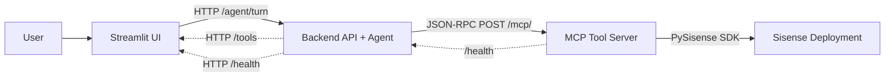

---

## 2. Core “turn” lifecycle (UI → Backend → MCP → Backend → UI)

A single user request (“turn”) follows this lifecycle:

1. UI collects input + relevant session configs (tenant or migration).
2. UI calls backend **`POST /agent/turn`** with **Accept: `text/event-stream, application/json`**.
3. Backend:
   - Retrieves/creates a long-lived MCP client for the session.
   - Runs the **agentic loop** (plan → execute → replan; see §2.5).
4. Backend streams progress to UI (SSE) and ends with a final result.
5. UI renders:
   - live progress lines
   - final assistant summary
   - tool result table/JSON
   - run log (collapsed expander)

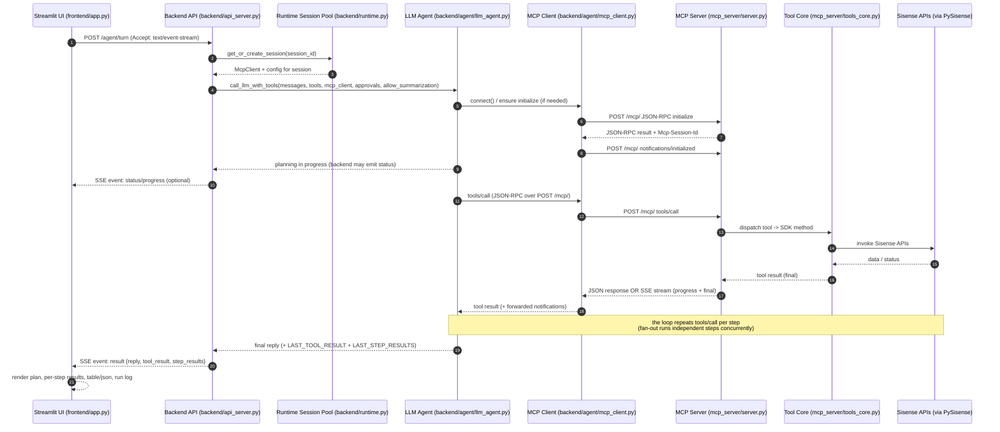

> The single `tools/call` above is one lap. A turn runs the loop below until the
> goal is met — a compound request executes several SDK calls, and independent
> steps fan out concurrently.

---

## 2.5 The agentic loop inside a turn (plan → execute → replan)

Standard **plan-and-execute** architecture. The turn is one loop
(`_reactive_loop` in `backend/agent/llm_agent.py`); the same three roles run
every turn. Full conceptual treatment (why narrow LLM calls, the verify design)
lives in [`AGENT_ARCHITECTURE.md`](./AGENT_ARCHITECTURE.md).

- **Orchestrator** (LLM) — drafts the plan from a compact capability catalog
  (every tool as `tool_id: one-line description`, **no schemas**), orders steps
  by dependency, and tags steps that need an earlier step's result. Revises the
  plan when an approach fails (replan).
- **Executor** (per step) — a two-stage route (119 tools → 1 package → ~10) then
  picks ONE tool + args and runs it via MCP. The tool-selecting LLM never sees
  all tools/schemas (hallucination control).
- **Critic** (LLM, independent) — before a "done" answer ships, re-reads the
  whole request against the results to catch skipped work. Summarization-ON only.

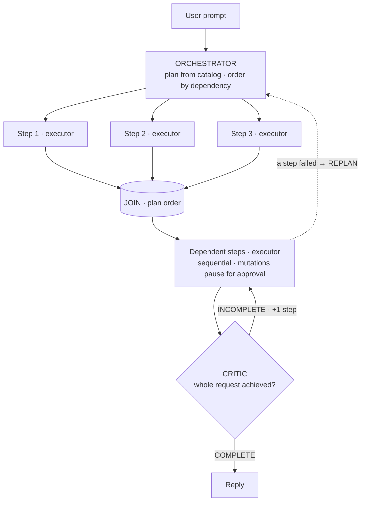

**Independent steps run in parallel** (`asyncio.gather`, width
`FES_MAX_PARALLEL_STEPS`); **dependent steps** run sequentially after the join,
because they need earlier results.

### The recovery ladder

Three mechanisms at increasing altitude — each fires only when the cheaper one
below can't help.

| Mechanism | Trigger | Changes | Who | Budget |
|---|---|---|---|---|
| **Backtrack** | routing/selection miss | same op, wider tool menu | code | 1/step |
| **Replan** | step result contradicts the plan | new approach for remaining work | LLM | `FES_MAX_REPLANS` |
| **Critic INCOMPLETE** | "done" but something's missing | +1 step (never a rewrite) | LLM | `FES_VERIFY_MAX_RECHECKS` |

Every stop is readable: goal met, step cap (`FES_MAX_AGENT_STEPS`) → partial +
what remains, or a needed value the user never gave → answer from what was
gathered.

---

## 3. SSE progress streaming (where it comes from)

There are **two** possible streaming paths:

### 3.1 UI ⇐ Backend streaming (primary for the UI)

The UI always requests SSE from the backend:
- UI sends `Accept: text/event-stream, application/json`
- Backend chooses SSE when streaming is enabled for that response path
- UI consumes events incrementally and renders progress

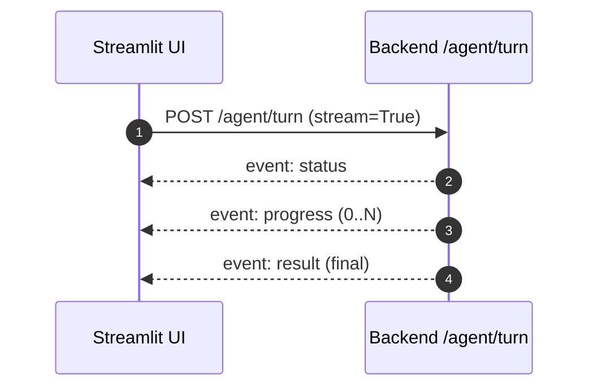

### 3.2 Backend ⇐ MCP Server streaming (tool progress)

For streaming-capable tools, the MCP server may return **`text/event-stream`** on the same POST `/mcp/` request:
- Contains **JSON-RPC notifications** (progress)
- Ends with a **JSON-RPC response** matching the request id

Your MCP client parses these notifications and forwards them to the backend runtime, which then forwards them to the backend SSE response.

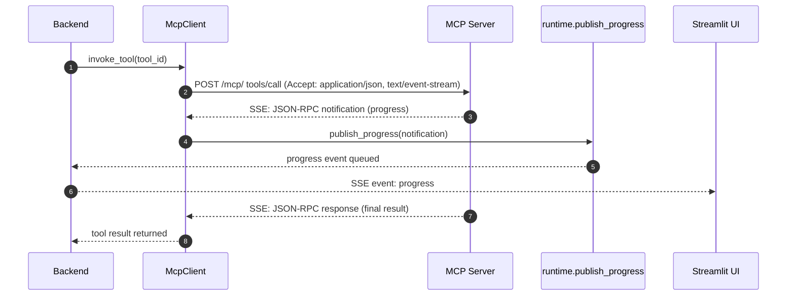

> Optional: Some MCP servers can also emit progress on a separate long-lived subscription stream (GET `/mcp/`).  
> Your client supports auto-subscribe, but your primary UX is via backend SSE to the UI.

---

## 4. Mutation approval flow (two-phase execution)

Mutating tools (create/update/delete/migrations) require user approval:

1. LLM selects a mutating tool
2. Agent does **not** execute it immediately
3. Backend returns a `pending_confirmation` payload
4. UI shows an approval panel with tool name + args
5. On approval, UI re-calls `/agent/turn` with `approved_keys`
6. Agent re-executes the request, now permitted to run the mutating tool

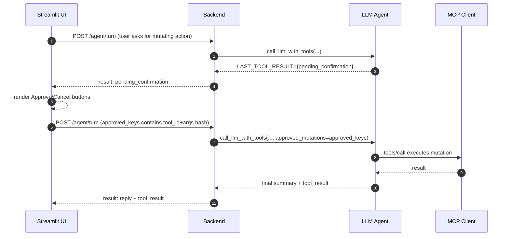

**Approval key stability**
- Approval is matched by: `(tool_id, normalized_args_json)`  
- UI stores a set of these keys and passes them back on approval.

---

## 5. Privacy mode: summarization disabled

`allow_summarization` is a **data-visibility switch**, not a loop on/off. It
governs whether tool result **data** ever reaches the LLM — enforced in code,
never by trusting the model.

### Behavior:
- **On** — result data reaches the loop. Adaptive (dependent) chains complete;
  the critic runs.
- **Off** — only metadata (`{tool, ok, count}`) reaches the LLM. The plan still
  runs; independent multi-step still works; **dependent steps are skipped up
  front** (the value they need is unreadable — the *dependency gate*) or stop
  gracefully (`BLOCKED`), and the reply names what was skipped. The critic is
  off. Tool results still render in the UI.

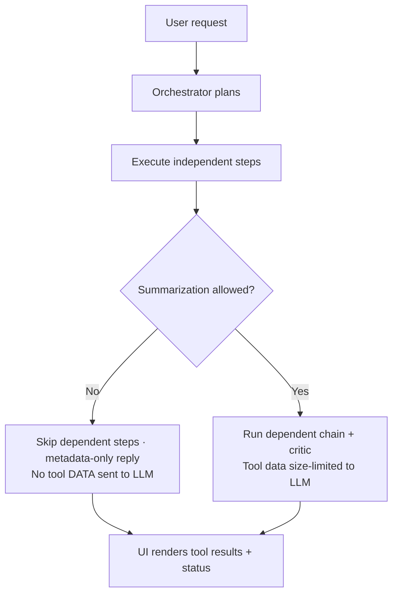

---

## 6. Session and MCP session correlation

### 6.1 UI session_id
- Streamlit creates a per-tab `session_id` and sends it on every `/agent/turn`.
- Backend uses this `session_id` to maintain a long-lived MCP client per UI tab.

### 6.2 MCP session id (`Mcp-Session-Id`)
- MCP server returns an `Mcp-Session-Id` header.
- MCP client stores it and includes it in subsequent requests.
- This enables correlated progress and consistent server-side session behavior.

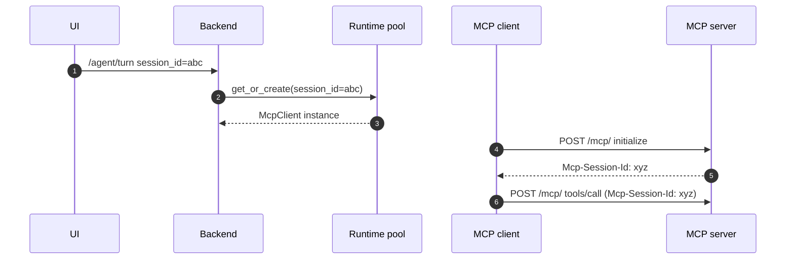

---

## 7. Execution flows by UI mode

### 7.1 Chat mode (single tenant)

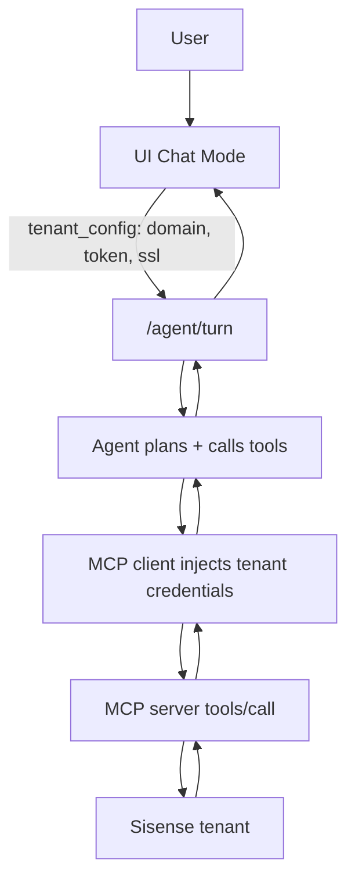

### 7.2 Migration mode (source + target)

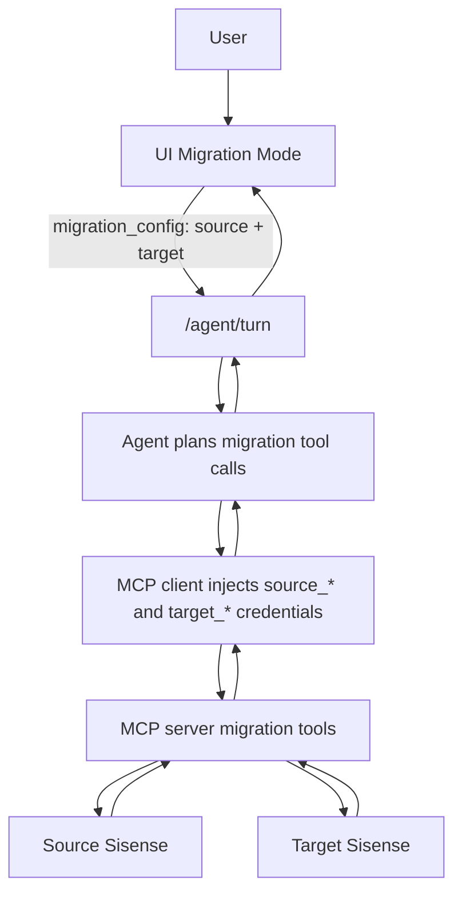

---

## 8. Appendix: event shapes (backend → UI)

Typical SSE event types:
- `status`:
  - `{ "phase": "planning" | "executing_tools" | "summarizing" | ... }`
- `progress`:
  - `{ "message": "...", "detail": "...", ... }`
- `result`:
  - `{ "reply": "<assistant text>", "tool_result": {...} }`
- `error`:
  - `{ "error": "<message>" }`
- `keepalive`:
  - `{ "ts": "<timestamp>" }`

---

## 9. Source of truth: modules and responsibilities

### 9.1 Execution responsibility chain (end-to-end, with agentic labels)

1. **Frontend (`frontend/app.py`) — Client UI / Session Controller**  
   Owns Streamlit session state, connection forms (tenant/migration), approvals UI, and sends `POST /agent/turn` with conversation history + connection details. Requests streaming with `Accept: text/event-stream, application/json`.

2. **Backend API (`backend/api_server.py`) — API Gateway + SSE Transport**  
   HTTP entry point (`/health`, `/tools`, `/agent/turn`). For `/agent/turn`, it handles the **SSE transport** to the UI and delegates execution to the runtime.

3. **Agent Runtime (`backend/runtime.py`) — Orchestrator Runtime / Session Manager**  
   Owns the per-UI-session runtime: a concurrency-safe session pool that maps `session_id → McpClient + configs`. Wires a per-turn progress callback used by backend SSE streaming.

4. **LLM Layer (`backend/agent/llm_agent.py`) — Agentic Loop (Orchestrator + Executor + Critic)**  
   This is the “agent brain” for a turn — the `_reactive_loop` (see §2.5):
   - **Orchestrator:** drafts/replans the dependency-ordered plan from the capability catalog  
   - **Executor:** per step, two-stage routes then picks + runs ONE tool via the MCP client; independent steps fan out concurrently  
   - **Critic:** independent goal check before a "done" answer ships (summ-on)  
   - **Policy/Guardrails:** two-phase mutation approval + the recovery ladder (backtrack / replan / recheck)  
   - Produces `LAST_TOOL_RESULT` (incl. `pending_confirmation`), `LAST_STEP_RESULTS`, and pause state (`LAST_PENDING_CLARIFICATION` / `LAST_PENDING_LOOP`)

5. **MCP Client (`backend/agent/mcp_client.py`) — Tool Transport Client (MCP Streamable HTTP)**  
   Executes tool calls over MCP Streamable HTTP:
   - Issues JSON-RPC over `POST /mcp/`
   - Consumes SSE when the MCP server streams tool progress
   - Maintains `Mcp-Session-Id` for MCP session correlation
   - Forwards MCP progress notifications into the runtime callback (so backend can stream them to UI)

6. **MCP Server Transport (`mcp_server/server.py`) — Tool Host Transport (Streamable HTTP + SSE)**  
   Implements MCP Streamable HTTP endpoints:
   - `GET /mcp` (optional subscription / keepalive for client probing)
   - `POST /mcp` for JSON-RPC (`initialize`, `tools/list`, `tools/call`)
   - Streams progress via SSE for streaming tool calls and returns a final JSON-RPC result frame

7. **Tool Router / Executor Adapter (`mcp_server/tools_core.py`) — Tool Router + Executor Adapter**  
   The server-side “tool execution brain”:
   - loads/normalizes the tool registry
   - resolves tool_id → SDK module/method
   - constructs PySisense clients (single tenant or migration source/target)
   - enforces argument validation/coercion + mutation audit rules
   - injects an `emit` callback for streaming tools and produces progress events

8. **PySisense SDK + Sisense APIs — Tool Implementation Layer**  
   The underlying SDK + Sisense REST APIs that perform the actual read/write/migration work.

### 9.2 Module-by-module responsibilities (implementation mapping)

- `frontend/app.py`
  - UI, session state, SSE parsing, progress rendering, approvals UX
- `backend/api_server.py`
  - HTTP API `/agent/turn`, SSE response streaming, tool list endpoint
- `backend/runtime.py`
  - session pool, long-lived MCP client per UI session, progress callback wiring
- `backend/agent/llm_agent.py`
  - the agentic loop: orchestrator (plan/replan), executor + fan-out, critic, mutation approvals, recovery ladder
  - (split across `_config.py` / `_prompts.py` / `_registry.py` / `_routing.py`)
- `backend/agent/mcp_client.py`
  - MCP JSON-RPC client, SSE parsing for MCP responses, session headers, retries/timeouts
- `mcp_server/server.py`
  - MCP Streamable HTTP transport, SSE for streaming tool calls, request routing
- `mcp_server/tools_core.py`
  - tool registry loading, SDK client construction, tool dispatch, emit/progress integration

### 9.3 Runtime flow across components (by source file)

```mermaid
flowchart LR
  A[frontend/app.py<br/>Client UI - Session Controller] --> B[backend/api_server.py<br/>API Gateway - SSE Transport]
  B --> C[backend/runtime.py<br/>Orchestrator Runtime - Session Manager]
  C --> D[backend/agent/llm_agent.py<br/>Agent Orchestrator<br/>Planner - Policy - Summarizer optional]
  D --> E[backend/agent/mcp_client.py<br/>Tool Transport Client<br/>MCP Streamable HTTP - SSE]
  E --> F[mcp_server/server.py<br/>Tool Host Transport<br/>POST mcp - SSE streaming]
  F --> G[mcp_server/tools_core.py<br/>Tool Router - Executor Adapter<br/>Registry to SDK dispatch - emit]
  G --> H[PySisense SDK<br/>Tool Implementation Layer]
  H --> I[Sisense APIs<br/>Deployment or deployments]
```