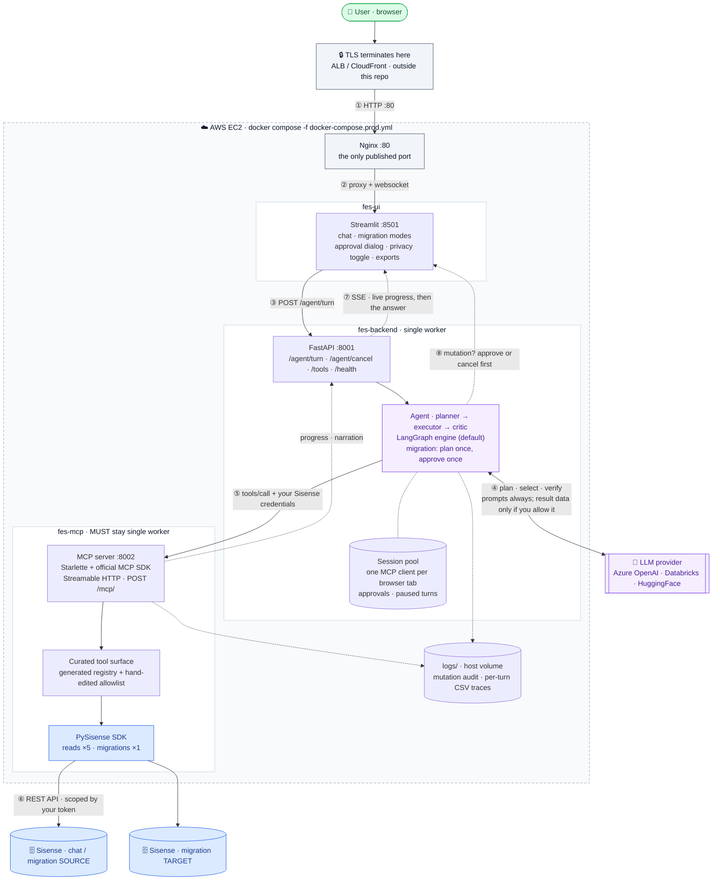

# 🤖 FES Assistant

**Explore, manage and migrate your Sisense environment — just ask.** Scoped to
your API token's permissions, and every change asks before it runs.

## ⚠️ Experimental Project Notice

**Community-contributed tool from Sisense Field Engineering.** This project is
an experimental tool developed by Sisense Field Engineering to facilitate
customer learning and exploration of Sisense capabilities. While maintained by
Field Engineering, it is shared "as-is" to encourage feedback and experimentation.

It is not part of the core Sisense product release lifecycle and does not
undergo the same validation, support, or certification processes as generally
available (GA) Sisense features. It is intended to complement, not replace,
officially supported Sisense features. See the **Community Disclaimer &
Liability Shield** at the end of this page, and
[docs/security.md](docs/security.md), before pointing it at anything real.

---

## 🚀 What it does

FES Assistant is an MCP-powered, agentic toolkit for Sisense environment
operations. Type natural language — *"which columns are unused in Sample
ECommerce?"*, *"migrate the groups, users and dashboards to the target
environment"* — and an agent selects the right [PySisense](https://github.com/sisense/pysisense)
SDK operation, executes it, and returns results or a summary.

It is for anyone who uses Sisense, at whatever access level the API token you
connect with already has: you see exactly what that token can see, and nothing
more. The Sisense API enforces that scoping on every call; the assistant never
widens what you are allowed to do.

* **📈 Dashboards & content:** find dashboards, audit widgets, run
  environment well-checks without digging through menus.
* **🏗️ Data models:** find unused fields, audit M2M relationships, build
  models through chat, prepare a model for Sisense AI with a perspective.
* **🛡️ Environments & governance:** migrate between environments or tenants
  with one approval for the whole ordered plan.

---

## 🏗️ How it's deployed



Two things the picture is deliberately honest about: **nothing in this repo
terminates TLS**, and **only the UI is ever exposed** — the backend and MCP
server sit on an internal network. Details in [docs/security.md](docs/security.md).

---

## Key agentic capabilities

* **Multi-step planning & self-correction.** The agent breaks a request into
  steps, runs independent ones in parallel, chains dependent ones, and
  **replans** when an approach fails — verifying it met your goal before it
  answers.
* **Autonomous infrastructure audits.** Many-to-many relationships, unused
  datamodel fields, orphaned assets, dashboard column usage — across the whole
  environment.
* **Guided migrations.** Cross-tenant moves for users, groups, datamodels and
  dashboards are planned in one shot, ordered by dependency, and shown as a
  single numbered approval dialog. Nothing writes until you approve; a failed
  step stops the run instead of cascading.
* **Protocol-first tool layer.** The tools live behind a **Streamable HTTP MCP
  server built on the official MCP SDK** — a standard interface, versioned tool
  schemas, streaming progress and cancellation. See
  [`mcp_server/README.md`](mcp_server/README.md).
* **Real-time progress.** Live updates over Server-Sent Events for every turn,
  and per-asset streaming for long migrations.
* **Privacy-first.** A **summarization toggle**, off by default, keeps raw Sisense
  data on your screen and out of the LLM when you need it to.

---

## Quickstart

```bash
uv sync                                  # reproducible env from uv.lock (Python 3.11)
cp .env.example .env                     # fill in your LLM provider
uvicorn mcp_server.server:app --host 0.0.0.0 --port 8002 --workers 1   # terminal 1
uvicorn backend.api_server:app --host 0.0.0.0 --port 8001              # terminal 2
streamlit run frontend/app.py                                          # terminal 3
```

Or with Docker: `docker compose up --build` and open `http://localhost:8501`.
Sisense credentials are entered in the UI, not in `.env`.

---

## Documentation

| | |
|---|---|
| [docs/usage.md](docs/usage.md) | Using the app — modes, approvals, the summarization toggle, example requests |
| [docs/architecture.md](docs/architecture.md) | How the agent works — the loop, routing, recovery, approvals, migration, the MCP transport, the tool registry |
| [docs/security.md](docs/security.md) | Exactly what the LLM sees, what leaves your infrastructure, deployment best practices |
| [docs/operations.md](docs/operations.md) | Configuration reference, production deployment and upgrades, logging |
| [docs/development.md](docs/development.md) | Running locally, testing tiers, rebuilding the tool registry after an SDK bump |
| [docs/design/](docs/design/) | Design documents for features in progress |
| [`mcp_server/README.md`](mcp_server/README.md) | The MCP server, and how it differs from a generic one |
| [`scripts/README.md`](scripts/README.md) | The registry rebuild pipeline |
| [`CLAUDE.md`](CLAUDE.md) | Rules and invariants for working on the codebase |

---

## Repository layout

```text
backend/            FastAPI API, session runtime, and the agent (planner → executor → critic)
frontend/           Streamlit UI
mcp_server/         MCP server on the official SDK; dispatches to the PySisense SDK
config/             Generated tool registry + the hand-edited allowlist that curates it
skills/             Sisense-authored procedures the agent plans from (one directory per skill)
scripts/            Registry generation from the SDK
tests/              unit (CI) · integration + eval batteries (live, local only)
docs/               Architecture, security, operations, development, designs
nginx/              Production reverse-proxy config
Dockerfile.*        One image per service; docker-compose.yml (dev) · docker-compose.prod.yml
```

---

## ⚖️ Community Disclaimer & Liability Shield

**Important: field-developed ecosystem extension.** These tools are
community-contributed projects developed by Sisense Field Engineering. They are
**not** official Sisense product features and do not fall under standard Sisense
SLAs, Support, or Security Certifications.

* **Local library execution (PySisense SDK):** as a Python package installed via
  PyPI, all logic executes locally on your workstation or server. No data is ever
  transmitted to Sisense Field Engineering.
* **Self-hosted applications (MCP server & FES Assistant):** designed to be
  deployed within your own private network or VPC. You maintain full ownership
  of the hosting environment, logs, and security configurations.
* **LLM data exposure & summarization:**
    * **FES Assistant:** features a manual **summarization toggle**. By default,
      the LLM only sees your prompt and tool definitions to determine intent.
      Optionally, when enabled, the raw response from the SDK (which may contain
      metadata or specific tool-level data) is sent to the LLM to generate a
      natural-language summary.
    * **MCP server:** when used with third-party clients (e.g. Claude Desktop,
      IDE agents), all data retrieved via the SDK is passed directly to the host
      client's LLM to generate a response.
* **Responsibility:** by using these tools, the customer/user acknowledges that
  Sisense metadata and API responses will be processed by their chosen LLM
  provider. Customers are **solely responsible** for ensuring their LLM provider
  (OpenAI, Anthropic, Databricks Foundation Models API, etc.) meets their
  organization's data privacy and security standards.
* **Liability & risk:** these tools are provided **"as-is"** for experimental
  purposes. Sisense and its employees are not liable for security
  vulnerabilities, third-party LLM data exposure, or environment disruptions.
* **Non-production recommendation:** we strongly recommend testing these tools in
  a sandbox environment and using them with a dedicated, limited-privilege
  Sisense service account.

---

## Related project

- [PySisense](https://github.com/sisense/pysisense) – the unofficial Python SDK
  for Sisense Fusion APIs. This project uses PySisense for Sisense-side actions
  and leverages its docs/examples to build the MCP tool registry.

## License

MIT — see [`LICENSE`](LICENSE).
