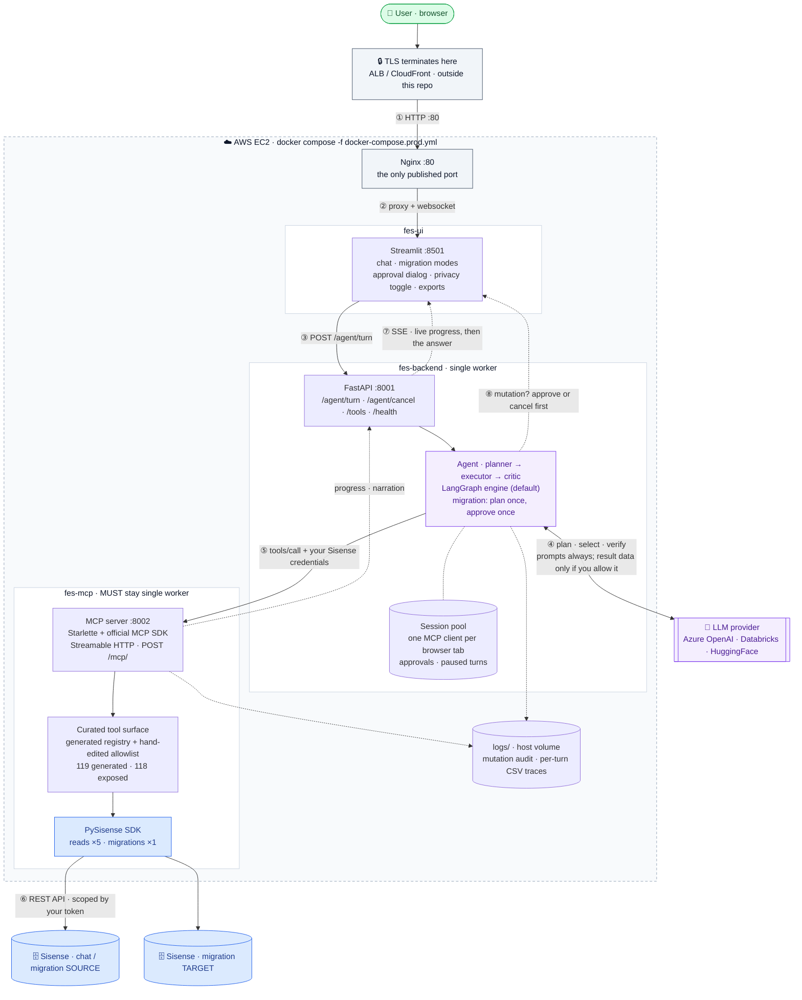

# 🤖 FES Assistant

**Explore, manage and migrate your Sisense environment — just ask.** Scoped to
your API token's permissions, and every change asks before it runs.

## ⚠️ Experimental Project Notice

### Community-Contributed Tool from Sisense Field Engineering

This project is an experimental tool developed by Sisense Field Engineering to facilitate customer learning and exploration of Sisense capabilities. While maintained by Field Engineering, it is shared "as-is" to encourage feedback and experimentation.

Important Disclaimer: This tool is not part of the core Sisense product release lifecycle and does not undergo the same validation, support, or certification processes as generally available (GA) Sisense features. It is intended to complement, not replace, officially supported Sisense features.

---

## Technical & Security Considerations

### Deployment & Execution Control
- Local SDK Usage (PySisense): All processing logic runs locally on your machine or server. No data is transmitted to Sisense Field Engineering.
- Self-hosted Components (FES Assistant / MCP Server): These components are designed for deployment within your own environment (on-prem or VPC). You maintain complete control over infrastructure, security configuration, access controls, and logs.

### Data & LLM Handling
- LLM Feature Status: The FES Assistant summarization feature is disabled by default.
- Data Transmission: When the summarization feature is enabled, responses retrieved via the Sisense SDK may be sent to your chosen Large Language Model (LLM) provider for processing.
- Customer Responsibility: Customers are responsible for selecting an LLM provider that meets their organization’s data privacy and security requirements.
- Optional Observability (LangSmith): Tracing is **disabled by default** (`LANGSMITH_TRACING=false`). If you enable it, trace metadata is sent to LangSmith (a third-party SaaS by LangChain, Inc.) under **your own** LangSmith account/API key. Tool result payloads are never sent; prompt/response content is additionally gated by `FES_LANGSMITH_LOG_CONTENT` (default `false`). Local CSV logging (`FES_CSV_OBSERVABILITY`, on by default) stays on your machine and never contains Sisense result data.

---

## Security & data handling — exactly what the LLM sees

The summarization switch decides whether **data returned from Sisense** may be
sent to your LLM provider. It is enforced in code at a single point
(`_transcript_step` → `_metadata_record` in `backend/agent/llm_agent.py`), not by
instructing the model — a prompt can be ignored, this cannot.

### Defaults and control

| | |
|---|---|
| Default | **OFF.** `ALLOW_SUMMARIZATION` is a backend-side hard cap — when `false`, no request can send result data to the LLM, regardless of the UI checkbox. The checkbox itself always starts OFF, and the API treats a missing `allow_summarization` field as `false` |
| Per request | Every `/agent/turn` call carries its own `allow_summarization`. Two users, or two turns by the same user, can differ |
| User control | A checkbox in the UI sidebar, sent with each turn. Hiding it with `FES_ALLOW_SUMMARIZATION_TOGGLE=false` also forces summarization off for every request |
| Scope | One turn. It is never remembered or inferred, and no model output can change it |

### Summarization OFF

Per executed step, the model's history receives **only**:

```json
{"tool": "access_management.get_user", "ok": true, "count": 12}
```

`count` appears only for list results. **No rows, no field values, no payload** —
for a successful call the model never learns anything Sisense returned, only that
something was returned and how many.

The model still sees, as it must to function at all:

- **your request**, verbatim — it cannot pick a tool or fill arguments otherwise.
  This includes anything you re-type from results shown on your screen: the
  switch governs what the *application* forwards from tool results, never what
  *you* choose to say
- **prior turns** of the conversation (`LLM_PLANNING_HISTORY_TURNS`, default 5)
- **tool names, descriptions and parameter schemas** for the ~10 tools routing selected
- **the arguments it proposes**, which derive from your words, not from results
- **the failure reason when a step fails** — see below

What the loop gives up in this mode:

- **Adaptive chains are refused, not attempted.** A step needing a value from an
  earlier result (`[needs-prior-result]`) is skipped up front, or the turn stops
  with `BLOCKED` and says so. It never guesses the value. (Example: "get user X,
  then list all users with X's role" — step 2 needs the role from step 1's
  result, which the model can't see, so the turn stops after step 1 and says
  why.)
- **The critic is off.** Judging whether a goal was met requires reading results.
- **Answers are rendered locally.** The final reply is built in code from the raw
  results (`_describe_results_local`) — the data goes to your screen, not to the model.

What still works in this mode — the switch is a data boundary, not a feature
kill:

- **Independent multi-step turns** ("list all datamodels AND all groups") run
  every step: knowing a step is done needs only `{ok, count}`, not the data.
- **Replanning after a failed step** still works — the decide call reasons from
  the metadata plus the failure reason (the one exception below).
- **Mutations, approvals, clarifications** are unchanged — the gate and the
  clarification questions are built in code either way.
- **Option lookups in clarifying questions** work identically in both modes.
  The question text carries the count of existing values (e.g. "I found 914
  existing options") and offers to list them as a follow-up turn; a few example
  names appear **below** the reply via a display-only field the UI never adds
  to the message text. Message text is what rides back to the model in history
  on later turns — so the names stay on your screen in every mode, and reach
  the model only if you type one (which is your input, always visible to it).
  A count is the same metadata the model already sees.
- **Migration turns lose nothing**: the plan is knowable from the request alone
  (no migration tool needs another's result), and the final summary is built in
  code from the SDK's own counters in **both** modes.

### The one exception: failure reasons

When a step fails, its `error` string is included:

```json
{"tool": "access_management.create_user", "ok": false,
 "error": "username/email already exists"}
```

**Why.** Without it the agent is blind exactly when it needs to think. In
practice: a create failed, the decide call saw `ok: false` and nothing else, and
it *invented* a cause — "ensure the email is not already in use." It happened to
be right. A recovery reasoned from a guess is worse than one reasoned from the
truth, and the alternative (a code table translating failures into approved
labels) replaces the agent's judgement with our own list of what can go wrong.

**The residual exposure, stated plainly.** An error usually restates what you
already typed — "username/email already exists" for the address *you* supplied —
so it rarely carries anything the model has not seen in your request. Not never:
an error raised deeper in the stack can quote a value you did not supply, such as
a row from a failing query or a name from a list the tool had fetched. If your
threat model cannot accept that, run with summarization off **and** treat the
error channel as in-scope for review; the behaviour is one function
(`_metadata_record`) and `tests/unit/test_summarization_boundary.py` pins it.

### Summarization ON

Tool results are sent to your LLM provider, shrunk first
(`_shrink_for_llm`: caps on list length, object keys, depth, string length and
total size — a size guard, not a privacy one). Assume **any field of any record a
tool returned may reach your provider**. In exchange the agent can complete
adaptive chains, verify its own work with the critic, and write answers in prose.

### Everything else, regardless of the switch

- **Credentials are never sent.** Domain, token and SSL settings are stripped
  from arguments before any LLM call and scrubbed from audit logs.
- **Mutations require explicit approval.** Nothing that writes runs without a
  dialog naming the operation and its arguments. Approvals are **single use** — the
  same request again asks again. Every execution is recorded in `logs/mutations.log`.
- **Cloud observability is opt-in.** `LANGSMITH_TRACING=false` by default; with
  it on, tool result payloads are never sent and prompt content is further
  gated by `FES_LANGSMITH_LOG_CONTENT`. Local CSV logs
  (`FES_CSV_OBSERVABILITY`, on by default) stay on your machine and carry
  request text + call metadata, never Sisense result data.
- **What lands on the host disk, and for how long.** Everything written stays
  in `logs/` on the machine running the stack — nothing is shipped in the
  images or the repo. At the default `FES_LOG_LEVEL=INFO` those files record
  *what happened* (tool, ok/failed, timing, the mutation audit) but not the
  rows Sisense returned; raising it to `DEBUG` adds full payloads, which then
  sit there for the 7-day retention. Application logs rotate daily and keep 7
  days, the observability CSVs roll at 50 MB keeping 5 rolls, and the audit
  logs are kept deliberately — so the directory is bounded, not unbounded,
  without an ops cron.
- **These controls live in the backend**, which is the only thing that talks to
  the MCP server in a deployed instance — the server itself publishes no port
  and is not an entry point.

---

## Recommended Usage Guidelines
- Environment: Use the tool primarily in sandbox or non-production environments.
- Access: Utilize a dedicated Sisense service account with limited privileges.
- Validation: Thoroughly review and validate the tool's behavior before any broader adoption within your organization.

---

## About FES Assistant

FES Assistant is an MCP-powered, agentic toolkit for Sisense environment operations. It helps you automate governance checks, migrations, and everyday Sisense workflows using natural language, so you can orchestrate tasks without writing one-off API scripts.

---

## 🚀 What it does

It is for anyone who uses Sisense, at whatever access level the API token you
connect with already has: you see exactly what that token can see, and nothing
more. The Sisense API enforces that scoping on every call, so the assistant
never widens what you are allowed to do.

* **📈 Dashboards & content:** Instantly find dashboards, audit widgets, and get environment well-checks without digging through menus.
* **🏗️ Data models:** Optimize models in plain language — find unused fields, audit M2M relationships, and build models through chat.
* **🛡️ Environments & governance:** Migrate between environments or tenants, run bulk governance, and orchestrate platform-wide changes as code.

---



Two things the picture is deliberately honest about.

**Nothing in this repo terminates TLS.** Nginx listens on plain `:80`, so HTTPS
has to come from a load balancer or proxy you put in front of it.

**Only the UI is ever exposed.** Nginx publishes the single host port and
proxies to Streamlit; the backend and the MCP server sit on an internal Docker
network and are unreachable from outside the instance. The MCP server is an
internal component of this application, not a public endpoint — see
[`mcp_server/README.md`](./mcp_server/README.md) for how it differs from a
generic MCP server and what connecting to it directly would require.

Running locally with `docker-compose.yml` differs in two ways: there is no
Nginx (the browser hits Streamlit on `:8501` directly), and the backend and MCP
ports bind to `127.0.0.1` only, since neither service authenticates its callers.

*For the full end-to-end execution flow (the agentic loop, SSE streaming, progress propagation, and the mutation approval flow), see [`AGENT_ARCHITECTURE.md`](./AGENT_ARCHITECTURE.md).*

---

## Key Agentic Capabilities

* **Multi-Step Planning & Self-Correction:** The agent breaks a request into steps, runs independent ones in parallel, chains dependent ones, and **replans** when an approach fails — verifying it actually met your goal before it answers.
* **Autonomous Infrastructure Audits:** Ask the agent to find Many-to-Many relationships, unused datamodel fields, or orphaned assets across your entire environment.
* **Guided Migrations:** Cross-tenant moves for users, groups, datamodels and dashboards are planned in one shot, ordered by dependency, and shown as a single numbered approval dialog — nothing writes until you approve, and a failed step stops the run instead of cascading.
* **Protocol-First Tool Layer:** The tools live behind a **Streamable HTTP MCP server built on the official MCP SDK** rather than ad-hoc HTTP glue — a standard interface, versioned tool schemas, and streaming progress and cancellation for free. See [`mcp_server/README.md`](./mcp_server/README.md).
* **Real-Time Progress Visibility:** Live streaming updates over **Server-Sent Events (SSE)** for long-running migrations and bulk tasks.
* **Privacy-First Logic:** Includes a manual **Summarization Toggle** to ensure raw data responses stay within your infrastructure when required.

---

## 🏗️ Architecture & Flow

The FES Assistant is built as a modular stack to ensure you can use the MCP server independently if desired:

- **The Cockpit:** A **Streamlit UI** (`frontend/app.py`) for mission control.
- **The Brain:** A **Backend API + Agent Layer** (`backend/api_server.py`, `backend/agent/`) running an **agentic loop** — a *planner* drafts the steps, an *orchestrator* (the loop) runs them (independent steps in parallel), and a *critic* verifies the goal before answering. Failed approaches trigger a replan. See [`AGENT_ARCHITECTURE.md`](./AGENT_ARCHITECTURE.md).
- **The Bridge:** An **MCP Streamable HTTP Server** (`mcp_server/server.py`) that translates AI intent into [PySisense](https://github.com/sisense/pysisense) SDK actions.

MCP Server docs: [Meta-Management MCP Server](mcp_server/README.md)

---

## Quick links

- [`docker-compose.yml`](./docker-compose.yml)
- [`docker-compose.prod.yml`](./docker-compose.prod.yml)
- [`Dockerfile.mcp`](./Dockerfile.mcp)
- [`Dockerfile.backend`](./Dockerfile.backend)
- [`Dockerfile.ui`](./Dockerfile.ui)
- [`.env.example`](./.env.example)
- [`config_prod.sh`](./config_prod.sh)

- [`frontend/app.py`](./frontend/app.py)
- [`backend/api_server.py`](./backend/api_server.py)
- [`backend/runtime.py`](./backend/runtime.py)
- [`backend/agent/llm_agent.py`](./backend/agent/llm_agent.py)
- [`backend/agent/mcp_client.py`](./backend/agent/mcp_client.py)

- [`mcp_server/server.py`](./mcp_server/server.py)
- [`mcp_server/tools_core.py`](./mcp_server/tools_core.py)

- [`AGENT_ARCHITECTURE.md`](./AGENT_ARCHITECTURE.md)
- [`scripts/README.md`](./scripts/README.md) — the registry rebuild pipeline

---

## Features

- **Two main modes in the UI**
  - **Chat with deployment**
    - Connect to a single Sisense deployment and talk to an agent that can inspect and operate on that environment.
  - **Migrate between deployments**
    - Connect **source** and **target** Sisense environments and use migration tools to move assets.

- **SSE progress streaming**
  - The UI streams agent turns and shows live progress updates.
  - Progress is captured into a per-run “run log” and rendered under assistant responses.
  - Works especially well for long migrations and bulk operations.

- **MCP-powered tools over PySisense**
  - PySisense SDK methods are wrapped as MCP tools and registered via a **tool registry JSON**.
  - Tools cover areas like access management, datamodels, dashboards, migration, and well-checks.

- **Multiple LLM backends (configurable) — via LiteLLM as an in-process gateway**
  - Switch between **Azure OpenAI**, **Databricks Model Serving**, and **HuggingFace Inference** by changing environment variables (`LLM_PROVIDER`).
  - All LLM traffic goes through one choke point (`call_llm_raw` → the **LiteLLM SDK**), which acts as a
    "gateway-as-a-library": unified API across providers, retries, provider-specific param handling —
    embedded in the backend process, with **no separate gateway service** deployed.
  - If centralized governance is ever needed (shared keys, per-team budgets, org-wide rate limits,
    cross-model fallback), the LiteLLM Proxy speaks the same interface — the single choke point means
    pointing `api_base` at a gateway is a config change, not a refactor.

- **Safety via explicit approval**
  - Nothing that writes runs without a dialog naming the operation and its arguments, and approvals are **single use** — repeating the same request asks again.
  - In **chat mode**, each mutating tool call is gated individually; a multi-step turn pauses at the mutation and resumes after approval.
  - In **migration mode**, the whole request is planned in one shot and shown as **one numbered dialog** listing every operation in dependency order (groups → users → datamodels → dashboards). Approving runs exactly that sequence; a failed step stops the run and the summary reports what ran, what failed, and what was not attempted.

- **Optional “no summarization” privacy mode**
  - You can disable sending tool results back to the LLM via an environment variable and (optionally) a UI toggle.
  - In that mode, tools still run, but the assistant only returns lightweight status messages.

- **UI conveniences**
  - Per-answer caption showing the turn's token usage and cost.
  - Thumbs up/down feedback on every answer, written to `logs/feedback.csv` (joins the observability CSVs by `trace_id`).
  - Export buttons on tool results — download as CSV, JSON, or TXT.
  - The chat input freezes while an approval dialog is pending, so a new message can't race an unanswered approval.
  - Domain normalization on connect — a bare domain like `mycompany.sisense.com` defaults to `https://`.

---

## Architecture

### The MCP layer

The tool layer is a real MCP server built on the **official MCP Python SDK**:
the transport is the SDK's `StreamableHTTPSessionManager` hosting a lowlevel
`Server`, and the backend talks to it with the SDK's `ClientSession` over
`streamablehttp_client`. The spec's own mechanisms are used where they exist:

- **Progress** — long-running tools report via spec
  `notifications/progress` (with `progressToken`), and human-readable
  narration rides alongside as `notifications/message` log frames tied to the
  request — the standard channels, not a private side-protocol.
- **Cancellation** — the primary path is the spec's `notifications/cancelled`
  per in-flight request. Because our cancellations can originate outside the
  MCP conversation (a Stop click, a browser disconnect), a small
  `POST /mcp/cancel` endpoint remains as an **operational fallback** that
  flags the whole session.

Two things are deliberate extensions beyond the spec, because this server's
client is our own agent rather than an end user with an OAuth identity:

- **Per-call multi-tenant credentials** (chat `domain`/`token`, migration
  `source_*`/`target_*`) injected by the backend on every call — instead of
  MCP's per-user OAuth model. Missing credentials are an error, never an env
  fallback.
- **A curated allowlist enforced at dispatch** (`config/allowed_tools.txt`),
  independent of what any client asks for.

Think of this repo as the **proving ground**: what a production Sisense MCP
actually needs — tool curation, approval gating, honest failure reporting,
long-running progress, cancellation — was discovered and battle-tested here.
The productized, spec-faithful server (standard MCP, OAuth, any client) is the
separate `sisense-admin-mcp` project.

High-level flow — the same path the diagram above shows, named file by file:

1. User interacts with **Streamlit** in `frontend/app.py`.
2. The UI calls the **backend API** (`backend/api_server.py`) over HTTP (for example `/health`, `/tools`, `/agent/turn`).
3. The backend:
   - Manages **per-session MCP clients** and state in `backend/runtime.py`.
   - Runs the **agentic loop** — planner (plan/replan), executors (route + tool selection, parallel fan-out), critic (goal verification), and mutation approvals. The default engine is a LangGraph `StateGraph` (`backend/agent/graph_engine.py`); a hand-rolled loop (`backend/agent/llm_agent.py`, `FES_AGENT_ENGINE=custom`) is the dependency-free fallback. Migration turns take their own single-shot path (`backend/agent/migration_flow.py`). See [`AGENT_ARCHITECTURE.md`](./AGENT_ARCHITECTURE.md).
   - Uses `backend/agent/mcp_client.py` — the official MCP SDK's `ClientSession` over Streamable HTTP — to call the MCP server.
   - Streams progress to the UI over SSE when the UI requests it.
4. The **MCP server** (`mcp_server/server.py`):
   - Hosts the official SDK's `StreamableHTTPSessionManager` at `/mcp/`.
   - Streams spec `notifications/progress` (+ narration as `notifications/message`) during long-running tool calls, and honors spec `notifications/cancelled`.
   - Exposes `/health` and the `POST /mcp/cancel` operational fallback.
   - Uses `mcp_server/tools_core.py` to map tool IDs to PySisense SDK calls.
   - Reads the tool registry JSON from `config/` and exposes only tools listed in `config/allowed_tools.txt`.
5. PySisense uses Sisense REST APIs to talk to your Sisense deployments.

### Folder structure

```text
Root/
  backend/
    agent/
      __init__.py
      llm_agent.py        # Agentic loop orchestration: planner (plan/replan), executors + fan-out, critic, approvals
      graph_engine.py     # Default turn engine: the same loop as a LangGraph StateGraph (FES_AGENT_ENGINE)
      migration_flow.py   # Migration mode's single-shot path: one plan, one approval dialog, sequential execution
      _config.py / _prompts.py / _registry.py / _routing.py / _tracing.py  # loop sub-modules
      mcp_client.py       # MCP client on the official SDK (ClientSession over Streamable HTTP)
    __init__.py
    runtime.py            # Session pool, long-lived McpClient per UI session, progress bridging
    api_server.py         # FastAPI backend (JSON + SSE on /agent/turn; exposes /health and /tools)

  config/
    tools.registry.json                 # Base tool registry generated from the SDK
    tools.registry.with_examples.json   # Registry enriched with curated examples (the one loaded at runtime)
    registry/                           # Same tools as a 3-level tree (index → package → mixin) for routing
    allowed_tools.txt                   # Hand-edited allowlist: unlisted tool_ids are never exposed

  frontend/
    app.py               # Streamlit UI (SSE client for backend /agent/turn)
    assets/sisense.png   # App favicon (the architecture diagram is Mermaid, inline above)

  logs/                  # Runtime logs (rotated; not committed)

  mcp_server/
    server.py            # MCP server on the official SDK (StreamableHTTPSessionManager at /mcp/; /health; /mcp/cancel)
    tools_core.py        # Registry loading, SDK client construction, tool dispatch, emit/progress integration

  scripts/
    __init__.py
    registry_core.py                    # Shared registry-building helpers used by scripts 01 and 02
    01_build_registry_from_sdk.py       # Introspects PySisense SDK and builds tools.registry.json (flat)
    02_add_llm_examples_to_registry.py  # Adds LLM examples; writes tools.registry.with_examples.json + config/registry/ tree
    03_sync_examples_to_registry_tree.py # Copies curated examples into the config/registry/ tree
    04_generate_tool_allowlist.py       # Audits/initialises config/allowed_tools.txt after a rebuild
    README.md                           # Notes for the scripts

  tests/
    conftest.py          # Seeds dummy env vars so unit-test imports succeed
    unit/                # Fast, mocked — run on every CI push
    integration/         # Live stack + real creds — local only (includes the eval batteries)

  .github/
    workflows/           # CI (unit tests) and CD pipelines

  .env.example
  .gitignore
  .dockerignore
  LICENSE
  README.md
  AGENT_ARCHITECTURE.md
  requirements.txt

  # Docker-related files
  Dockerfile.backend        # Image for backend FastAPI service
  Dockerfile.ui             # Image for Streamlit UI
  Dockerfile.mcp            # Image for MCP Streamable HTTP server
  docker-compose.yml        # Local/dev docker-compose (uses .env)
  docker-compose.prod.yml   # Example production compose (uses real env vars)
  config_prod.sh            # Example script to export prod env vars (no secrets)
```

---

## Prerequisites

- Python 3.11 (pinned `>=3.11,<3.12`)
- A Sisense Fusion deployment (or multiple, for migration use cases)
- Access to at least one LLM provider:
  - Azure OpenAI,
  - Databricks Model Serving, or
  - HuggingFace Inference API
- (Optional but recommended) Docker + Docker Compose for containerized runs

---

## Environment configuration

This project keeps **LLM credentials and service configuration** in environment variables.  
Sisense base URLs and tokens are entered directly into the Streamlit UI and stored only in session state for the current browser session.

For local development you can use a `.env` file (see [`.env.example`](./.env.example)).  
In Docker / production, you should set the same values as real environment variables on each container (for example via `--env-file`, `docker-compose` `env_file:`, or sourcing `config_prod.sh`).

> **[`.env.example`](./.env.example) is the authoritative, fully annotated list** — every
> variable with its default, allowed values, and effect in plain language. The sections
> below cover only the ones you are most likely to touch.

### 1) UI (Streamlit) configuration

Read by `frontend/app.py`:

- `FES_LOG_LEVEL`  
  Log level for the UI process: `DEBUG`, `INFO`, `WARNING`, `ERROR`.

- `FES_BACKEND_URL`  
  URL of the backend FastAPI server that the UI calls for each turn.  
  Example: `http://localhost:8001`

- `FES_UI_IDLE_TIMEOUT_HOURS`  
  Idle timeout in hours for a Streamlit session. When exceeded, the UI clears `st.session_state`.

- `FES_ALLOW_SUMMARIZATION_TOGGLE`  
  Controls whether the “Allow summarization” checkbox is enabled in the UI.  
  - `true`  → user can toggle per session  
  - `false` → checkbox is disabled and always off

### 2) Backend (FastAPI) configuration

Read by `backend/api_server.py` and `backend/agent/llm_agent.py`:

- `FES_LOG_LEVEL`  
  Same as UI; controls backend logging.

- `ALLOW_SUMMARIZATION`  
  Backend hard kill switch for sending tool results (Sisense data) to the LLM.  
  - `true`  → allowed (subject to UI toggle)  
  - `false` → never sent to the LLM

- `LLM_PROVIDER`  
  Which LLM backend to use: `azure`, `databricks`, or `huggingface`.

- `FES_AGENT_ENGINE`  
  Which engine runs the agentic loop: `langgraph` (default — LangGraph `StateGraph`) or
  `custom` (the hand-rolled loop, kept as a dependency-free fallback). Both run the same
  contract over the same helpers; the unit suite passes under each.

- `FES_TOOL_EXAMPLES`  
  How many curated `user_query → arguments` examples each tool's description carries on the
  tool-selection LLM call: `0`–`3`, default `1`. The first example is also shown to users as
  a "how you could phrase this" hint in approval dialogs and clarification questions.

Azure OpenAI (when `LLM_PROVIDER=azure`):

- `AZURE_OPENAI_ENDPOINT`
- `AZURE_OPENAI_DEPLOYMENT`
- `AZURE_OPENAI_API_KEY`
- `AZURE_OPENAI_API_STYLE` (usually `v1`)

Databricks (when `LLM_PROVIDER=databricks`):

- `DATABRICKS_HOST`
- `DATABRICKS_TOKEN`
- `LLM_ENDPOINT`

Optional LLM retry tuning:

- `LLM_HTTP_MAX_RETRIES`
- `LLM_HTTP_RETRY_BASE_DELAY`

### 3) Backend → MCP client configuration

Read by `backend/agent/mcp_client.py`:

- `PYSISENSE_MCP_HTTP_URL`  
  Base URL for the MCP server. The client connects to `/mcp/` under this base URL.

- `PYSISENSE_MCP_HTTP_TIMEOUT`  
  Timeout (seconds) for MCP calls, applied both as the per-request timeout and the
  stream read timeout. Set it high enough for your longest migration (the shipped
  default in `.env.example` is 30 minutes).

### 4) MCP tool server / PySisense configuration

Read by `mcp_server/tools_core.py` and `mcp_server/server.py`:

- `PYSISENSE_REGISTRY_PATH`  
  Path to the tools registry JSON.  
  Default: `config/tools.registry.with_examples.json`

- `FES_TOOL_ALLOWLIST`  
  Path to the hand-edited allowlist of tool_ids (default: `config/allowed_tools.txt`).  
  Only listed tools are exposed — to the agent, to the tool-selection LLM, and at the MCP
  server's dispatch boundary. A missing file means allow-all with a warning, never deny-all.

- `PYSISENSE_SDK_DEBUG`  
  Optional flag passed down to `SisenseClient.from_connection(debug=...)`.  
  Set to `true` or `false`; when unset it follows the log level (`FES_LOG_LEVEL=DEBUG` → on).

#### Concurrency caps (single-worker friendly)

These reduce head-of-line blocking with long-running migrations while keeping the MCP server at a single worker:

- `PYSISENSE_MAX_CONCURRENT_MIGRATIONS` (default: `1`)  
  Max number of migrations allowed to run concurrently.

- `PYSISENSE_MAX_CONCURRENT_READ_TOOLS` (default: `5`)  
  Max number of short/read tools allowed to run concurrently while migrations run.

### 5) Sisense configuration (entered in the UI, not in `.env`)

In **Chat with deployment** mode:
- Sisense domain (base URL)
- API token
- Verify SSL flag

In **Migrate between deployments** mode:
- Source domain + source API token (+ source SSL flag)
- Target domain + target API token (+ target SSL flag)

These credentials are supplied via the Streamlit forms, used to build `SisenseClient` instances inside the MCP tool server, and are not persisted.

---

## Tool registry generation

The MCP server uses a **tool registry JSON** that describes available tools, parameters, descriptions, and examples.

There are two stages:

1. `config/tools.registry.json` – built directly from the PySisense SDK.
2. `config/tools.registry.with_examples.json` – the same registry but enriched with examples.

Scripts in [`scripts/`](./scripts/) are responsible for this:

1. [`01_build_registry_from_sdk.py`](./scripts/01_build_registry_from_sdk.py)  
   Introspects the PySisense SDK classes, parses docstrings, infers JSON Schemas for parameters, tags tools, and writes `config/tools.registry.json` (the flat base registry only).

2. [`02_add_llm_examples_to_registry.py`](./scripts/02_add_llm_examples_to_registry.py)  
   Reads `config/tools.registry.json`, uses an LLM to generate examples per tool, and writes `config/tools.registry.with_examples.json` **plus** the 3-level routing tree under `config/registry/`.

Both share helpers in [`scripts/registry_core.py`](./scripts/registry_core.py). Run them as modules (`python -m …`; a plain `python scripts/01_….py` fails on the package-relative imports):

```bash
python -m scripts.01_build_registry_from_sdk          # config/tools.registry.json
python -m scripts.02_add_llm_examples_to_registry     # with_examples.json + config/registry/ tree
python -m scripts.03_sync_examples_to_registry_tree --write   # examples-only sync (no SDK needed)
python -m scripts.04_generate_tool_allowlist          # audit allowlist drift after a rebuild
```

At runtime, only the JSON files in `config/` are needed.

---

## Running locally (without Docker)

This is a simple three-process dev setup.

1) Create and activate a virtual environment

```bash
python3.11 -m venv .venv
source .venv/bin/activate     # Windows: .venv\Scripts\activate
```

2) Install dependencies

```bash
pip install --upgrade pip
pip install -r requirements.txt
```

Or, with [uv](https://docs.astral.sh/uv/), skip steps 1–2 and get the exact locked versions in one go:

```bash
uv sync    # creates .venv from uv.lock (Python 3.11 pinned)
```

3) Create a `.env` (see [`.env.example`](./.env.example))

4) Start the MCP Streamable HTTP server

In terminal 1:

```bash
uvicorn mcp_server.server:app --host 0.0.0.0 --port 8002 --workers 1
```

Why `--workers 1`:
- MCP Streamable HTTP sessions are stateful, and running multiple workers can break session continuity unless you add sticky routing.
- This project relies on a single worker and uses concurrency caps + streaming progress to stay responsive during long migrations.

5) Start the backend API

In terminal 2:

```bash
uvicorn backend.api_server:app --host 0.0.0.0 --port 8001
```

6) Start the Streamlit UI

In terminal 3:

```bash
streamlit run frontend/app.py
```

7) Open the UI

Streamlit will print a local URL (typically `http://localhost:8501`).

---

## Development & testing

```bash
uv sync                       # reproducible env from uv.lock (or: venv + pip install -r requirements.txt)
uv run pytest tests/unit -q   # or just: pytest tests/unit -q
```

Tests come in three marker tiers (defined in `pyproject.toml`):

| Tier | Command | Needs |
|---|---|---|
| **Unit** | `pytest tests/unit -q` | Nothing — mocked, fast, runs in CI |
| **Integration** | `pytest tests/integration -m integration -v` | The live 3-service stack + real credentials |
| **Eval batteries** | `pytest tests/integration -m eval -v` | Same — regression prompts asserting agent behavior |

Integration and eval tests need live Sisense + LLM credentials and are **never run
in CI** — LLM and Sisense secrets are deliberately kept out of GitHub Actions. To
run them locally, copy
[`tests/integration/integration_config.example.yaml`](./tests/integration/integration_config.example.yaml)
to `tests/integration/integration_config.yaml` (gitignored) and fill in real
values; tests skip automatically when it is missing. See
[`tests/integration/README.md`](./tests/integration/README.md) for details.

---

## Running with Docker (local/dev)

The repo includes three Dockerfiles and a `docker-compose.yml` for local development:

- [`Dockerfile.ui`](./Dockerfile.ui) – Streamlit UI
- [`Dockerfile.backend`](./Dockerfile.backend) – FastAPI backend
- [`Dockerfile.mcp`](./Dockerfile.mcp) – MCP tool server
- [`docker-compose.yml`](./docker-compose.yml) – runs all three together

### 1) Create a `.env` for local Docker

Create a `.env` in the project root with your LLM and service configuration (same keys as in the Environment configuration section).  
This file is not committed to git and is not baked into images.

### 2) Build and start the stack

From the project root:

```bash
docker compose up --build --force-recreate
```

Then open:

- UI: `http://localhost:8501`
- Backend docs: `http://localhost:8001/docs` (dev/local only)
- MCP health: `http://localhost:8002/health` (dev/local only)

In the production compose file only the Nginx port (80) is published — the
backend and MCP ports stay internal to the compose network.

### Useful Docker commands

Stop the stack:

```bash
docker compose down
```

Hard reset (remove containers, images, volumes, and build cache):

```bash
docker compose down --rmi all --volumes --remove-orphans
docker builder prune -a -f
```

---

## Production-style deployment (example)

For production you typically:

- Push built images to a registry (Docker Hub, ECR, etc.)
- Use a separate compose file (for example [`docker-compose.prod.yml`](./docker-compose.prod.yml))
- Set environment variables on the host or via your orchestrator

An example non-secret env script is included: [`config_prod.sh`](./config_prod.sh).

Secrets like `AZURE_OPENAI_API_KEY` or `DATABRICKS_TOKEN` should be provided via a secure channel (SSM Parameter Store, Secrets Manager, etc.).

SSE notes for production reverse proxies:
- The shipped [`nginx/default.conf`](./nginx/default.conf) does **not** need
  `proxy_buffering off`: browser↔UI traffic is a Streamlit websocket, not SSE
  (the SSE hop is UI↔backend, inside the compose network, and never crosses
  Nginx). It does set a long `proxy_read_timeout` for the websocket.
- If you put a different proxy in front of the **backend** (port 8001) so that
  SSE does cross it, disable proxy buffering and raise idle timeouts for
  long-lived responses there.

---

## Using the app

### 1) Chat with deployment

- Select **Chat with deployment**.
- Enter Sisense domain, API token, and SSL preference.
- Click **Connect**.

Example questions:

- “List all dashboards.”
- “Show all users in the ‘Analysts’ group.”
- “Find all fields that are not used in datamodel XYZ.”

For write operations (create/update/delete), you will see a confirmation step before execution.

### 2) Migrate between deployments

- Switch to **Migrate between deployments**.
- Fill in Source and Target Sisense environments (domain + token + SSL).
- Connect both.

Example requests:

- “Migrate the Sales Team group and the user jane@acme.com.”
- “Migrate all datamodels, overwriting existing ones.”
- “Migrate all users, groups and dashboards.”

The whole request is planned in one shot and shown as a single numbered
approval dialog, ordered by dependency (groups → users → datamodels →
dashboards). Nothing runs until you approve; a failed step stops the run, and
the final summary is built from the SDK's own counters (succeeded / failed /
not attempted).

---

## Logging

- Log files are written under `logs/` (git-ignored, and excluded from the
  images — a deployment creates its own). Application logs rotate daily and
  keep 7 days; the CSVs roll at 50 MB and keep 5 rolls; the two audit logs
  never rotate (audit ≠ observability). Nothing in `logs/` grows without bound.
- Sensitive values such as tokens are scrubbed before being written.
- The shipped default is `FES_LOG_LEVEL=INFO`, which records what ran — every
  tool call, ok/failed, timings, the mutation audit — without writing Sisense
  result rows to disk. `DEBUG` adds full (secret-scrubbed) tool payloads and
  prompts, which is the right trade on a machine you control but means your
  Sisense data sits in `logs/` for 7 days. Worth deciding before you need it: the level
  is read at startup, so it cannot be raised *after* something odd happened.

### What each file is

| File | Written by | What's in it |
|---|---|---|
| `llm_agent.log` | agent loop | plans, tool selections, decisions — the main debugging read |
| `llm_routing.log` / `llm_registry.log` | routing / registry modules | tool-menu navigation; registry + allowlist loading |
| `backend_runtime.log` | session runtime | turns started/ended, session pool, cancellations |
| `backend_api.log` | FastAPI layer | request-level view of `/agent/turn` |
| `mcp_client.log` | backend↔MCP client | MCP session lifecycle, spec progress notifications |
| `server.log` | MCP transport | `tools/call`s and cancellations at the server door |
| `tools_core.log` | tool executor | SDK dispatch, credential routing, results (scrubbed) |
| `pysisense.log` | the PySisense SDK itself | the SDK's own logging (verbose at DEBUG) |
| `app.log` | Streamlit UI | frontend events |
| `mutations.log` / `server_mutations.log` | backend / MCP audit | every executed write, recorded at BOTH enforcement layers on purpose (the MCP one also catches non-backend callers); always on, never rotated |
| `llm_traces.csv` / `llm_calls.csv` / `tool_calls.csv` | observability | one row per turn / LLM call / tool run; on by default (`FES_CSV_OBSERVABILITY=false` turns them off) |
| `feedback.csv` | UI | one row per thumbs up/down a user gives an answer (verdict, optional comment, question, tools); joins the observability CSVs by `trace_id` |
| `*_run.log` (`mcp`/`backend`/`ui`) | your launcher's stdout redirect | uvicorn/streamlit process output; under Docker this is the container log instead |

---

## 🔒 Security & Deployment Best Practices

While this is an experimental tool, we recommend the following "Security First" approach for your deployment:

* **Authentication:** Deploy the UI and Backend behind your organization’s SSO, a VPN, or a Secure Reverse Proxy (e.g., Nginx with Auth).
* **Credential Management:** Use a dedicated, limited-privilege Sisense Service Account and ensure your LLM API keys are stored securely (e.g., via environment secrets, not hard-coded).
* **Network Isolation:** Implement network-level restrictions (firewalls/VPC rules) so only trusted internal hosts can reach the Backend and MCP server endpoints.
* **Service Scoping:** Publish only the UI. The backend and MCP server authenticate no one, so they belong on an internal network — which is what `docker-compose.prod.yml` does. If you ever need to reach them from another machine, tunnel (SSH, Tailscale) rather than publishing the port.

---

## ⚖️ Community Disclaimer & Liability Shield

**Important: Field-Developed Ecosystem Extension**

These tools are community-contributed projects developed by Sisense Field Engineering. They are **not** official Sisense product features and do not fall under standard Sisense SLAs, Support, or Security Certifications.

* **Local Library Execution (PySisense SDK):** As a Python package installed via PyPI, all logic executes locally on your workstation or server. No data is ever transmitted to Sisense Field Engineering.
* **Self-Hosted Applications (MCP Server & FES Assistant):** These are designed to be deployed within your own private network or VPC. You maintain full ownership of the hosting environment, logs, and security configurations.
* **LLM Data Exposure & Summarization:**
    * **FES Assistant:** Features a manual **Summarization Toggle**. By default, the LLM only sees your prompt and tool definitions to determine intent. Optionally, when enabled, the raw response from the SDK (which may contain metadata or specific tool-level data) is sent to the LLM to generate a natural language summary.
    * **MCP Server:** When used with third-party clients (e.g., Claude Desktop, IDE Agents), all data retrieved via the SDK is passed directly to the host client's LLM to generate a response.
* **Responsibility:** By using these tools, the customer/user acknowledges that Sisense metadata and API responses will be processed by their chosen LLM provider. Customers are **solely responsible** for ensuring their LLM provider (OpenAI, Anthropic, Databricks Foundation Models API, etc.) meets their organization’s data privacy and security standards.
* **Liability & Risk:** These tools are provided **"as-is"** for experimental purposes. Sisense and its employees are not liable for security vulnerabilities, third-party LLM data exposure, or environment disruptions.
* **Non-Production Recommendation:** We strongly recommend testing these tools in a sandbox environment and using them with a dedicated, limited-privilege Sisense Service Account.

---

## Related project

- [PySisense](https://github.com/sisense/pysisense) – the unofficial Python SDK for Sisense Fusion APIs. This project uses PySisense for Sisense-side actions and leverages its docs/examples to build the MCP tool registry.

---

## License

This project is licensed under the MIT License. See the [`LICENSE`](./LICENSE) file for details.
