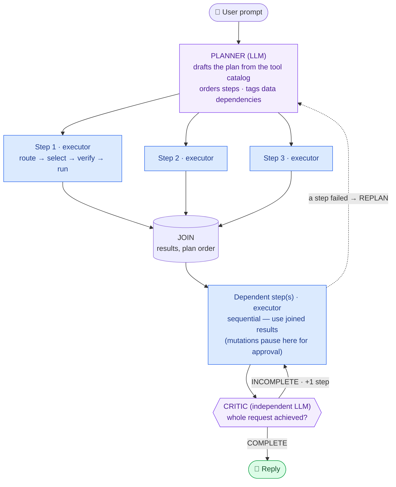
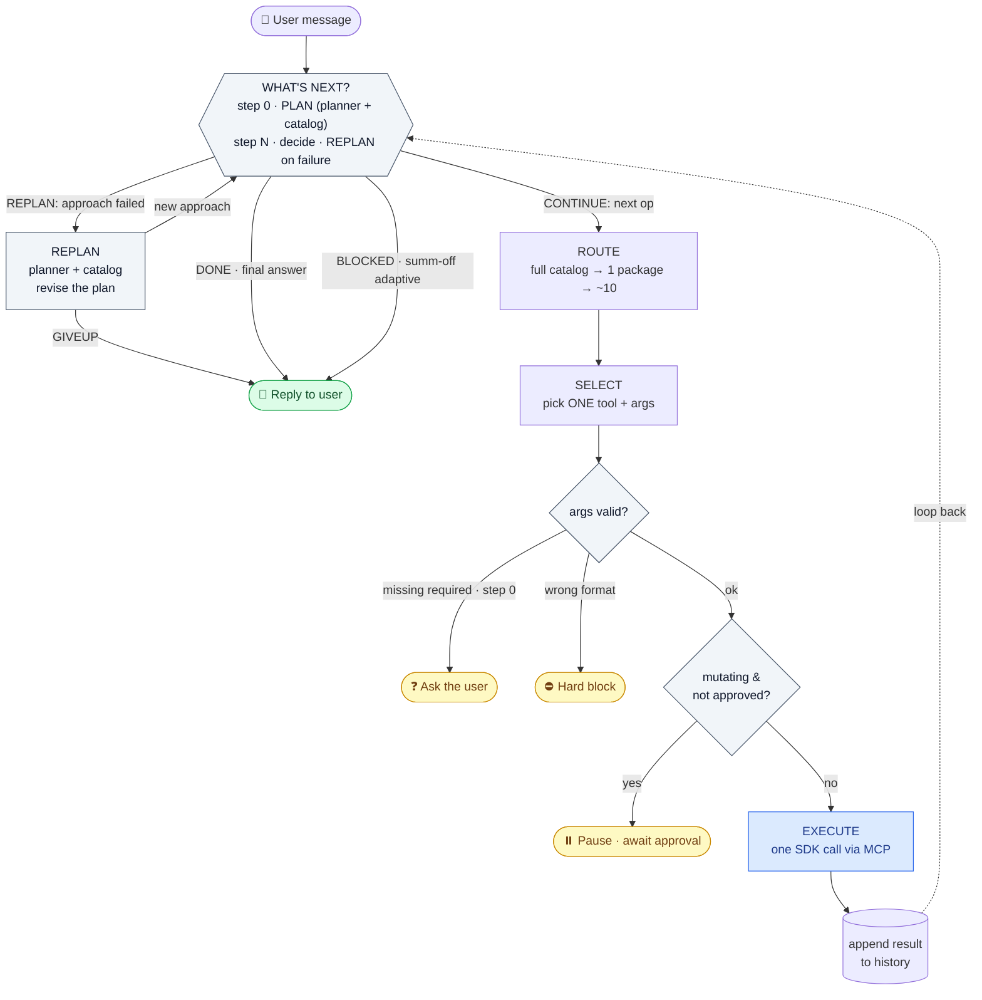

# FES Assistant — Agent Architecture

> Living document describing how the agent actually works: the agentic loop —
> plan → parallel fan-out → dependent chains → recovery ladder → human-gated
> mutations → critic — plus migration mode's single-shot path, the tool
> registry and its curated surface, and the MCP transport underneath. Both
> engines described here are exercised by CI: the unit suite runs twice, once
> under `FES_AGENT_ENGINE=langgraph` and once under `custom`.
>
> This is the *why*. The operating rules are `CLAUDE.md`; configuration and
> deployment are `docs/operations.md`; the security model is `docs/security.md`.

---

## The one big idea

There is **no single "smart" LLM call** that reads your message and orchestrates
everything. Instead, a turn is a **pipeline of narrow LLM calls**, each with one
small job, wired together by ordinary Python code (`call_llm_with_tools` in
`backend/agent/llm_agent.py`). The intelligence is in how the code composes many
dumb-but-reliable calls — not in any one call being clever.

Each LLM call sees only what it needs:

| Call | Sees | Decides |
|---|---|---|
| **Plan (planner)** | your message + capability catalog (one-liners) | the ordered plan; its first operation starts the loop |
| **Route L1** | one sub-task | which package (of ~a dozen)? |
| **Route L2** | one sub-task | which mixin within that package? |
| **Select (executor)** | one sub-task + ~10 tools | pick exactly ONE tool + its arguments |
| **Decide** | your message + results so far | done (answer) or continue (next op)? |

Crucially, the **tool-selection call never sees the whole request and never sees
more than ~10 tools.** It cannot "choose to call two tools across packages"
because it never sees two packages at once. Multi-part requests are handled by
the _planner_ (plan/replan) and _decide_ calls, one layer above the
tool-selection step.

Why build it this way? Because the full tool catalog is over a hundred tools.
Showing all of them to one call produces hallucinated tool names and noisy
plans. The routing hierarchy narrows the menu to ~10 relevant tools before the
selection call ever picks — and that narrowing is what makes each pick reliable.

---

## The processes

```
Browser (Streamlit :8501)
  └── POST /agent/turn ─▶ FastAPI backend (:8001)
                            └── MCP Streamable HTTP ─▶ MCP server (:8002)
                                                          └── PySisense SDK ─▶ Sisense API
```

The agent logic lives entirely in the backend. The MCP server is a generic
tool-executor over the PySisense SDK; it has no notion of the loop. Both sides
of that hop are the **official MCP Python SDK** — see "The MCP transport"
below for progress, cancellation, and session correlation. The deployed shape —
EC2, containers, the one published port, external systems — is the Mermaid
diagram in the README; this is just the hop order.

**LLM access — gateway-as-a-library.** Every LLM call goes through one choke
point (`call_llm_raw` in `_routing.py`) using the **LiteLLM SDK** in-process:
unified API over Azure OpenAI / Databricks (env-switched), retries, param
dropping. There is deliberately **no standalone LLM gateway service** — keys
live with the backend. If centralized governance were ever needed (shared keys,
budgets, org-wide rate limits), the LiteLLM Proxy speaks the same interface, so
the migration is pointing `api_base` at it — a config change at one choke point.

---

## Sessions and modes

### Session management

Each browser tab gets a UUID (`session_id`) generated once and stored in
`st.session_state`. It is sent with every `/agent/turn` request.

The backend maintains `SESSION_POOL: Dict[str, SessionEntry]` — a long-lived
`McpClient` per session. Clients are reused across turns and replaced only when:
- idle > 9 hours (`SESSION_IDLE_TIMEOUT`)
- Sisense connection config changed (domain/token)

A single user with two tabs gets two separate MCP clients and two separate
conversation histories. Per-turn results are snapshotted **inside** the turn
task (no `await` between the loop returning and the snapshot), so concurrent
sessions cannot swap each other's results; the `LAST_*` module globals remain
only as unit-test/debug aids.

### Mode selection

Two logical modes, selected in the UI sidebar:
- **Chat**: single Sisense deployment — non-migration tools only
- **Migration**: source + target deployments — migration tools only

Mode is determined by `_select_tools_for_mode(mode)` in `api_server.py`, which
filters the tool registry by `meta.module == "migration"`.

**The turn's tool universe is scoped once, at entry.** `call_llm_with_tools`
re-filters the incoming `tools` by mode (`_tool_matches_mode`) and that list is
what the loop uses — `_select_tools_for_mode` falls back to returning *all*
tools when its filter comes up empty (a broken-registry safety valve), which
would otherwise put chat tools into a migration turn. Historically mode was a
rule each code path had to remember while the loop rebuilt its own menu from the
full registry; two paths forgot (later-step routing, and the keyword fallback's
hardcoded tool IDs). Scope it once, then enforce at the execution choke point —
don't re-derive it per call site.

**How migration mode differs inside the loop** (all four enforced in code, both
engines):

| | Chat | Migration |
|---|---|---|
| Routing | two-stage L1→L2 navigation | **bypassed** — `_navigate_for_step` hands over the turn's scoped tool list directly, on *every* step. Routing exists to keep ~110 tools off the selection call; 9 already is a menu. The L1 index is not mode-aware, so walking it here can pick a chat tool, and chat tools get no credentials in migration mode (`_inject_credentials` sends non-migration tools down `_with_tenant`, and `tenant_config` is empty) |
| Fan-out | independent steps run concurrently | **off** — every migration tool mutates, and the gate is one-at-a-time |
| Planner catalog | non-migration tools | migration tools only (`_capability_catalog`) |
| Context prompt | `CHAT_PLANNING_CONTEXT_PROMPT` | `MIGRATION_PLAN_SYSTEM_PROMPT` carries the **dependency order**: groups → users → datamodels → dashboards. A Sisense invariant (a user cannot join a group that does not exist; a dashboard cannot resolve against an unmigrated datamodel), not a scenario patch — which is why it is allowed in a prompt at all |

Migration mode has **no read tools**, so it cannot resolve a name to an ID
mid-plan. `migrate_dashboard_shares` needs concrete ID lists, so a request that
only names a dashboard dead-ends or clarifies. Adding read tools means also
deciding which environment they read from and plumbing credentials for it. The
full single-shot path is described under "Migration mode" below.

---

## The full flow — orchestrator view (high level)

Standard plan-and-execute shape: a **planner** drafts and repairs the plan; an
**orchestrator** — the loop — runs it, dispatching **executors** one step each
(independent steps in parallel); and a **critic** independently evaluates the
goal before the answer ships.



- **Planner** = `_make_plan` / `_replan` (sees the tool catalog as
  one-liners, writes prose steps, never calls tools)
- **Orchestrator** = the loop (`_reactive_loop`) that reads the plan and runs it
  — dispatch → execute → decide → replan/next; the planner is a step inside it
- **Executor** = one route→select→validate→execute pipeline per step
  (`_execute_branch` when parallel, the loop body when sequential)
- **Critic** = `_verify_goal_complete` — separate context, adversarial prompt
- Independent steps fan out concurrently (`FES_MAX_PARALLEL_STEPS`); dependent
  steps run after the join; mutations always pause for human approval

Each executor step runs through the reactive loop machinery detailed next.

---

## The agentic loop

One user turn can chain multiple tool executions. It is a single loop
(`_reactive_loop`) wrapped in **plan → execute → replan**: on the first pass a
planner call drafts the full plan (request + a compact capability catalog —
tool one-liners, no schemas) and the plan is shown to the user; every later pass
a decide call picks the next move. When a step's outcome shows the approach
cannot work (failed / found nothing / wrong kind of data), decide says
`REPLAN:` and the planner revises the plan with the catalog — a retry that
CHANGES approach, budgeted by `FES_MAX_REPLANS`. Each lap executes **exactly
one** SDK call.



Reading it: the diamond **WHAT'S NEXT?** is the only thing that changes by step —
the planner's plan on the first lap, decide after (with `REPLAN:` routing back
through the planner when an approach fails). Green = the turn ends with an answer;
yellow = it pauses or blocks (and resumes/explains); blue = the one SDK call this
lap. The dashed edge is the loop: append the result, ask "what's next?" again.

- **DISCOVER / PLAN** = the planner's plan, then route + tool-pick per step
- **EXECUTE** = call the tool via MCP — one SDK call per lap
- **VERIFY** = the decide call (+ the independent critic at "done")
- **ITERATE** = `CONTINUE:` feeds the next sub-task back through routing;
  `REPLAN:` sends the failure back through the planner for a new approach

Stop conditions (every one returns something readable — never a silent stop):
- decide returns a plain answer → goal met
- `FES_MAX_AGENT_STEPS` reached → partial answer + what still remains
- a continued step needs info the user never gave → *overreach*, stop and
  answer from what was gathered (`_finalize_from_transcript`)
- a mutating tool → pause for approval, resume next turn (see below)

**Multi-turn context:** the planner receives the last
`LLM_PLANNING_HISTORY_TURNS` turns via `_build_planning_history()`, so
follow-ups ("xyz datamodel" after a clarifying question) resolve with prior
context. History is fully client-supplied — the backend keeps no conversation
of its own.

### Worked example — a compound request

**User:** _"show me all datamodels and also show me all the user groups"_

| # | LLM call | Given | Result |
|---|---|---|---|
| 1 | Plan (planner) | full message + capability catalog | _"1. List all datamodels 2. List all user groups"_ — step 1 starts |
| 2 | Route L1 | _"List all datamodels"_ | `datamodel` |
| 3 | Route L2 | _"List all datamodels"_ | core |
| 4 | Select | sub-task + ~10 datamodel tools | `datamodel.get_all_datamodel` |
| — | _execute_ | | 400 datamodels |
| 5 | Decide | full message + result | _"CONTINUE: list all user groups"_ |
| 6 | Route L1 | _"list all user groups"_ | `access_management` |
| 7 | Route L2 | _"list all user groups"_ | groups |
| 8 | Select | sub-task + group tools | `access_management.users_per_group_all` |
| — | _execute_ | | 35 groups |
| 9 | Decide | full message + BOTH results | final answer combining both |

The "break it into two" decision lives in **call 1** (the planner's plan)
and is re-checked by **call 5** (decide notices what's still undone — and can
say `REPLAN:` if a step's outcome shows the approach failed). The tool-selection
call (calls 4, 8) only ever picks one tool from a small menu and never sees the
compound request.

### Two kinds of multi-step

- **Static / independent** — _"show all datamodels AND all groups."_ Both parts
  are knowable from the request alone; neither needs the other's result. Works
  in **both** summarization modes.
- **Adaptive / dependent** — _"get the username for user_id xyz, then find which
  datamodels that user owns."_ Step 2 needs step 1's *output* to form its
  request. The decide call must *read* step 1's result — so adaptive chains
  complete only with summarization **on**; with it off they stop gracefully
  (`BLOCKED`).

This distinction drives the summarization switch below.

---

## Anatomy of a turn — every call, with inputs and outputs

### High level — the calls in order

A turn is **one loop** (`_reactive_loop`), the same body every step:

```
loop, until done:
    WHAT'S NEXT?          step 0 → PLAN: planner + catalog → ordered plan (shown)
                          step N → DECIDE: CONTINUE · REPLAN · DONE · (off) BLOCKED
    ROUTE L1              which package? (of ~a dozen)
    ROUTE L2              which mixin? (→ ~10 tools)
    SELECT                pick ONE tool + args from those ~10
    (validate · gate)     code, no LLM — schema check, mutation approval
    EXECUTE               run the tool via MCP → result → back to WHAT'S NEXT?
```

Each box is one LLM call except *validate/gate* (code) and *execute* (MCP);
a clarification question, when one is needed, is also rendered in code — see
"Clarification" below. The
only thing that differs by step is **WHAT'S NEXT?** — on the first pass the
planner drafts the plan (request + capability catalog) and its first
operation starts the loop; on later passes the decide call reads goal + history
and ends the turn (its answer becomes the reply), emits `CONTINUE:` (next
sub-task into ROUTE), or emits `REPLAN:` (the planner revises the plan with
the catalog + failure evidence). There is no separate step-1 code path.

### Detailed — an adaptive request, call by call

**User:** _"get the details of user jane.doe@example.com, then list all other
users who have that same role"_ — adaptive: step 2 needs the *role* that step 1
returns.

For each call: the **prompt logic** (what it's told to do, not the full text),
its **input**, and its **output**.

**1 · PLAN (planner)** — _logic:_ draft the ordered plan using the capability
catalog (tool one-liners, no schemas); dependency order, not sentence order;
never promote a descriptive word into an object name.
- in: the full user message
- out: `"Get the details of user jane.doe@example.com"`
  _(the prerequisite — you can't list by role until you have the role)_

**2 · ROUTE L1** — _logic:_ reply with the one package that fits, or `none`.
- in: `"Get the details of user jane.doe@example.com"`
- out: `access_management`

**3 · ROUTE L2** — _logic:_ pick the mixin within that package.
- in: same sub-task
- out: `users` → loads ~10 user tools

**4 · SELECT** — _logic:_ pick ONE tool; fill only args the user actually gave;
never use a placeholder for a missing one.
- in: sub-task + the ~10 user tools
- out: tool_call `access_management.get_user(user_email="jane.doe@example.com")`

**· validate · gate** — code: args pass the schema; tool is not mutating → no
approval needed.

**5 · EXECUTE** — MCP → SDK → Sisense.
- in: `get_user`, `{user_email: "jane.doe@example.com"}`
- out: `{ok: true, result: {firstName: "Jane", role: "sysAdmin", groups: [...]}}`

**6 · DECIDE (after step 1)** — _logic (data mode):_ given the goal + results so
far, reply `CONTINUE: <next op>` or the final answer; do prerequisites first;
counting/filtering is your job, not a CONTINUE.
- in: goal + history containing step-1's **full result** (role visible)
- out: `"CONTINUE: list all users whose role is sysAdmin"`
  _(it read `role: sysAdmin` out of the result — this is the adaptive hand-off)_

**7 · ROUTE + SELECT + EXECUTE (step 2)** — as above for the new sub-task.
- select out: `access_management.get_users_with_role_names_and_group_names()`
- execute out: `{ok: true, result: [ ...all users with roles... ]}`

**8 · DECIDE (after step 2)** — everything asked for is present.
- in: goal + both results
- out: final answer — _"Jane is a sysAdmin; no other users share that role."_

### A real captured turn, event by event

The same shape measured live (chat mode, summarization ON, adaptive two-step
chain — _"which group does john.doe@example.com belong to and show all
the users in that group"_). Twelve events, every one narrow:

| # | Kind | Event | Tokens / outcome |
|---|---|---|---|
| 1 | LLM | planner | 2670 in / 32 out |
| 2 | LLM | route L1 | 898 in / 3 out |
| 3 | LLM | route L2 | 251 in / 2 out |
| 4 | LLM | select | 1336 in / 26 out |
| 5 | TOOL | `access_management.get_user` | ok |
| 6 | LLM | decide | 872 in / 14 out |
| 7 | LLM | route L1 | 896 in / 3 out |
| 8 | LLM | route L2 | 249 in / 2 out |
| 9 | LLM | select | 1007 in / 19 out |
| 10 | TOOL | `access_management.users_per_group` | ok |
| 11 | LLM | decide → final answer | 4280 in / 123 out |
| 12 | LLM | verify (critic) | 3889 in / 3 out |

Worth noticing: the routing calls cost 2–3 output tokens each — they are that
narrow — and the only calls that ever see result data (6, 11, 12) are exactly
the ones the summarization switch governs. The planner's output was two prose
lines, the second tagged `[needs-prior-result]`; the select calls each saw ~10
schemas from one mixin, never the full catalog.

### The same request with summarization OFF

Only call 6 changes — and it changes everything downstream:

**6 · DECIDE (nodata mode)** — _logic:_ you see only which tools ran + ok/count,
never the data; reply `CONTINUE` for an undone independent op, `BLOCKED` if the
next op needs a value you can't see, or `DONE`.
- in: goal + history = `{tool: get_user, ok: true, count: 1}` — **no role**
- out: `"BLOCKED: need jane's role from step 1, which I can't see"`

→ the loop stops, keeps step 1's result, and replies: _"I got the user's
details, but listing others with the same role needs a value I can't read with
summarization off — turn it on to continue,"_ then renders step 1 locally. The
role data never reached the LLM.

Contrast a **non-adaptive** request (_"list all datamodels and all groups"_):
call 6's nodata decide sees `{tool: get_all_datamodel, ok, count: 400}`, which
is enough to know that part is done, so it replies `CONTINUE: list all user
groups` and the loop runs both — no block, because neither step needs the
other's data.

---

## The summarization switch _(as built)_

`ALLOW_SUMMARIZATION` is a **hard privacy control: when false, tool result *data*
is never sent to the LLM.** It is NOT "loop vs no loop" and NOT "skip the prose
summary." The reactive loop runs in **both** modes — the flag only changes **how
much of each result the decide call sees:**

| | Summarization ON | Summarization OFF |
|---|---|---|
| `history` the decide call sees | full tool results | **action metadata only** — `{tool, ok, count, error}`, never the data |
| Multi-step (independent tasks) | yes | **yes** (knows what's done from metadata) |
| Adaptive (pass a value between steps) | yes (reads the id/name) | no — value isn't in history → `BLOCKED`, stop + explain |
| Final answer | LLM prose | local raw description (rendered in-process, no LLM) |

**Where the boundary is enforced:** one place in code — `_transcript_step`
builds each step's history entry with the full result (`_shrink_for_llm`) when
summ is on, or `_metadata_record` (`{tool, ok, count}`) when off. The model
*physically never receives* data it shouldn't. It is *told* the mode (via the
`AGENT_DECIDE_NODATA` prompt) so it can explain the limit — but the guarantee is
that data was never put in the messages, **never that the model was asked not to
look.** Never trust the model to enforce a privacy boundary.

**Adaptive degrades gracefully — and cheaply.** Two layers:

1. **Plan-time dependency gate (code).** The planner tags plan steps that
   need a value from an earlier step's RESULT (`[needs-prior-result]`) — pure
   text reasoning, privacy-safe. With summ off, code splits the plan there:
   the independent prefix runs, the dependent tail is **skipped up front** (no
   doomed call, no wasted replan) and named in the reply with "turn
   summarization on to run it".
2. **Runtime safety net (decide).** Anything the plan missed still hits the
   `AGENT_DECIDE_NODATA` `BLOCKED:` reply — the loop stops and says _"the rest
   needs a value from an earlier step I can't see with summarization off"_ and
   renders what it got, locally.

**Failure reasons are the one exception** (decided 2026-08-08). A failed step
contributes `error` on top of `{tool, ok, count}`; a successful one never does.
Without it the loop is blind exactly when it needs to think — a failed create
left the decide call with `ok: false` alone and it invented a cause. A recovery
reasoned from a guess is worse than one reasoned from the truth, and the
alternative (a code table mapping failures to approved labels) replaces the
agent's judgement with our enumeration of what can go wrong. Errors normally
restate what the user already typed, so they rarely add anything the model has
not seen; when they don't, that residual exposure is documented in
`docs/security.md` rather than hidden.

**How much they can carry is the SDK's call, not ours.** The string comes from
`utils._extract_error_message` — a recognised Sisense response yields that
server's sentence plus its status; an unrecognised one falls back to the body
itself, capped at 300 chars, credentials redacted upstream. Don't trim or
filter it here: a local cap would be behaviour the SDK does not document, the
sibling MCP project would not inherit it, and the same SDK would then behave
two ways. If the aperture ever needs narrowing, the place is the SDK.
`tests/unit/test_summarization_boundary.py` pins the scope — reason on failure,
never a payload on success.

**Result data on screen is always allowed.** The switch governs what reaches
the *LLM*, not the *user*: tables render in both modes, and `display_hints` is
the screen-only channel for option names in clarifications. Anything the UI
shows from `tool_result` / `step_results` never re-enters a prompt.

**Irreducible floor:** tasks that branch on result *content* (unknown iteration
count driven by the data — "restart every failed datamodel") are only possible
with summ on. Not a design choice — reacting to data requires seeing data.
Ordering/sequencing is text reasoning (mode-independent); only value-passing
needs the data.

### The four flows

Non-adaptive compound — _"show all datamodels AND all groups"_:

```
                    plan (planner) → "1. list datamodels 2. list groups"
SUMM ON:   route→plan→exec(datamodels)  ─┐ history=full data
           decide: CONTINUE list groups  │
           route→plan→exec(groups)       │
           decide: DONE → LLM prose combining both
SUMM OFF:  route→plan→exec(datamodels)  ─┐ history=metadata {ok,count}
           decide(nodata): CONTINUE      │
           route→plan→exec(groups)       │
           decide(nodata): DONE → local render "400 datamodels… 35 groups…"
```
Both run the two steps. Only the *final answer* and *what the decide call saw*
differ. (Verified live.)

Adaptive — _"get user X's details, then list others with that same role"_:

```
SUMM ON:   exec(get_user) → history has role=sysAdmin
           decide: CONTINUE "list users with role sysAdmin"   ← reads the role
           exec(get_users_with_role) → decide: DONE → prose answer
SUMM OFF:  exec(get_user) → history = {ok, count} (NO role)
           decide(nodata): BLOCKED "need the role from step 1, can't see it"
           → stop + explain + local render of step 1
```
Same first step; summ-on passes the value and finishes, summ-off blocks. (Verified live.)

### Why this shape

- **First LLM decision is a planner.** Step 1 and every later step are the same
  "what's next?" question, run by the **one** `_reactive_loop` — step 1 is not a
  special path. On the first pass the planner (`_make_plan`) drafts the plan;
  on later passes the decide call reads goal + history, with `REPLAN:` routing
  back through the planner when an approach fails.
- **All reactive** — re-decide each step from goal + history — so unknown-shape
  tasks work (summ on).
- Tradeoff: one LLM call per step (vs one up-front plan). Worth it — flexibility
  is the point of an autonomous agent.

---

## Verify — how the loop checks its work

There is no single VERIFY box; checking happens at three points, at two levels
of trust.

| # | Checks | When | Who | Trust |
|---|---|---|---|---|
| 1 | the **call** is well-formed | before execute | `jsonschema.validate` (`args valid?`) | objective — code |
| 2 | the **step** succeeded | after execute | the result's `ok` flag (`_metadata_record`) | objective — code |
| 3 | the **whole request** is done | at "done" | the decide call (maker), then an independent **critic** — an LLM call | judgment — LLM |

**Per-step (1 and 2) is deterministic code** — a schema passes or it doesn't; `ok`
is true or false. No LLM, nothing to second-guess.

**Goal completion (3) is judgment, so it gets a maker/checker pair:**

- **Maker** = the decide call (`WHAT'S NEXT?`). When it stops emitting `CONTINUE`
  it believes the request is satisfied.
- **Critic (the checker)** = an independent call (`_verify_goal_complete`,
  `VERIFY_GOAL_SYSTEM_PROMPT`) that re-reads the *whole* request against the
  results, prompted adversarially to find what was missed. It sees only goal +
  results (not the maker's reasoning), so it doesn't inherit the maker's
  rationalisations. `INCOMPLETE: <op>` pushes the loop one more step; `COMPLETE`
  accepts the answer.

Why a checker only on #3: the maker is biased toward declaring victory and can't
catch its own "stopped too early." A second, differently-prompted pass catches
that. #1 and #2 need no checker — code doesn't misjudge schemas or booleans.

**Summarization-on only.** Judging whether the goal was actually *achieved* means
reading the results — so the checker runs only when summarization is on. With it
off the checker would see just metadata (which the decide call already checked),
adding an LLM call for no real depth; there it's skipped and the decide call's
`DONE` stands.

Guards: `FES_VERIFY_GOAL` toggles it; `FES_VERIFY_MAX_RECHECKS` (default 1) bounds
overrides; the step cap still applies; any checker failure defaults to *complete*
so it can never block a good answer. Cost: one extra LLM call per turn (summ-on).

Ceiling: the checker is still an LLM judging completion — better than the maker
alone, not infallible. And "the whole request" means the current turn's prompt;
there is no standing cross-turn goal.

---

## The recovery ladder

Three recovery mechanisms at increasing altitude — each fires only when the
cheaper one below it can't help. **Backtrack fixes the step, replan fixes the
strategy, the critic fixes completeness.**

| Mechanism | Granularity | Trigger | What it changes | Who | Budget |
|---|---|---|---|---|---|
| **Backtrack** | within one step | routing/selection miss (no tool picked) | same op, **wider tool menu** (whole package instead of ~10) | code | 1 retry per step |
| **Replan** | triggered by a step, revises the **request's remaining plan** | a step's result contradicts the plan (failed / found nothing / wrong data), or a dead end | **new approach** — the planner + catalog rewrites what's left | LLM (planner) | `FES_MAX_REPLANS` per turn |
| **Critic INCOMPLETE** | whole request, at "done" | the maker declared done but something is missing | pushes **+1 step** (a missing op) — never rewrites the plan | LLM (critic) | `FES_VERIFY_MAX_RECHECKS` |

Two clarifications that prevent a common misreading:

- There is **no separate step-level replan**: when a step fails, the
  planner re-plans everything *remaining* for the request (catalog +
  failure evidence) — one mechanism, one budget, three trigger points
  (decide's `REPLAN:` verb, routing dead-end, planning dead-end).
- There is **no standalone request-level replan** that fires without a step
  failure. The closest thing is the critic — but it only *adds* a missing
  step; it never rewrites the plan.

---

## Mutation approval

A mutating tool never executes without explicit approval, **even mid-loop**.

- The loop pauses at the gate, saves its state (`pending_loop` in
  `SessionEntry`: transcript + step count + the exact tool & args).
- The turn returns a plain-English explanation of what will change.
- On the next turn, if the user approves that exact tool+args, it executes
  **directly** (no re-plan — deterministic) and the loop **resumes from where it
  paused** and continues.
- A second mutation later in the same loop pauses again — approval is always
  per-operation.
- Approvals are **single use**: the key is `(tool_id, canonical-JSON args)` and
  it is consumed as it authorises, so asking for the identical operation again
  gates again.

(Migration mode gathers ONE approval for the whole ordered plan instead — see
"Migration mode" below.)

### The two-phase flow, end to end

1. A mutating tool is selected → returns a `pending_confirmation` dict inside
   the turn's result (with a plain-English `reason`)
2. UI stores this and renders an approval dialog
3. User approves → UI re-calls `/agent/turn` with `approved_keys` containing the
   ONE `(tool_id, args_json)` just approved
4. Backend **consumes** the approval (`_consume_approval`) → executes the tool

Every gate — sequential, fan-out branch, pending-loop resume, both engines —
goes through `_consume_approval()`, which discards the key as it authorises.
Asking for the identical operation again gates again, whether that repeat comes
later in the same turn (a decide `CONTINUE`, a critic push) or in a later turn.
A dialog that silently stops appearing is worse than no dialog: the user has
learned to expect it. Check-and-discard happens with no `await` between, so
concurrent fan-out branches cannot both claim one approval.

### What the dialog says — and deliberately doesn't

**The dialog discloses in code, not via the LLM** (`_approval_disclosure`), and
discloses only what the tool definition states: which optional settings the
schema declares, which this call left unset, and their enum values (`action`
(skip / overwrite / duplicate)) — the model picks those silently otherwise.
Appended on **every** path including the LLM-failure fallback template, because
a model free to write prose is free to omit the overwrite choice.

It says **nothing about scope or blast radius**. A tool definition does not
record whether an empty target list means "everything", "nothing", or a hard
error; that lives in SDK code the registry never sees, and it differs per tool.
An earlier attempt inferred it from a naming convention and produced a warning
that was confidently wrong ("this will run without a target list" for a call
that raises). When the definition cannot confirm it, say nothing: let the call
run and report the SDK's own error verbatim (`_describe_tool_result`).

Optional params surface in exactly two places, both modes: a clarification
question (inline) and this dialog (as a block). One selection function
(`_optional_specs`) feeds two renderers so the two cannot drift.

### Known gap — preconditions the registry does not carry

Several SDK methods `raise ValueError` on argument combinations that JSON Schema
`required` cannot describe: `migrate_dashboards` needs exactly one of
`dashboard_names` / `dashboard_ids` (given neither it raises — it does **not**
migrate everything), `change_ownership` only works with `migrate_share=True`,
and `migrate_dashboard_shares` rejects id lists of unequal length. Every
selector is optional in the generated schema, so such a call passes validation
and fails inside the SDK with the SDK's own error rather than a clarifying
question.

Do **not** paper over this by hand-writing the rules into the registry or a code
table. The registry is generated from the SDK; invented entries are data no
rebuild reproduces and no reader can trace back to a source. If these should be
enforced, the constraints have to come from the SDK itself — a machine-readable
declaration on the methods, or generator logic that derives them — so a rebuild
keeps them true. Until then the agent must not assert what a call will do when
it cannot know.

In fan-out, mutating branches never execute concurrently — they **defer to the
sequential loop** so the gate is handled one at a time. Two mutations in one
plan produce two sequential dialogs, never one combined. Mutations are logged to
`logs/mutations.log` (backend) and `logs/server_mutations.log` (MCP dispatch) —
both layers on purpose; the MCP one also catches non-backend callers.

---

## Clarification

If step-1 planning leaves a required argument missing (the user never provided
it), the turn pauses and asks, then resumes next turn with the answer. The
selection call is shown a schema with `required` stripped (`planner_schema`) so
it omits values it doesn't have rather than hallucinating placeholders;
validation against the *real* schema then routes genuinely-missing fields into
the clarification loop.

The question itself is **rendered in code, not by an LLM**: it names the
missing fields with their schema descriptions, lists the optional settings the
schema declares, and shows the tool's curated first example as a "how you could
phrase this" template. A model free to write the question is free to omit the
choice that matters; code cannot.

A missing param whose schema carries `x-options-tool` (curated in
SCHEMA_RULES, e.g. `setup_datamodel.connection_name` → `get_connections`) also
gets a **live option lookup**, run by code. The question *text* gains only the
count and a list-on-request offer — text is an assistant message, and message
content re-enters LLM prompts via planning history and clarify-resume
anchoring, so a count (metadata) may live there and names (result data) may
not, in either summarization mode. The example names travel in
`display_hints`, a screen-only response field the UI renders under the reply
and never merges into `content` — the user sees them regardless of the
summarization switch, and the model sees a name only when the user types it.
A failed lookup logs and ships the plain question; it never blocks the ask.

Mid-loop, a continued step that needs unprovided info is treated as decide
*overreach* (see above) — the loop stops and answers, rather than asking a
confusing question about something the user never mentioned.

If the user **changes topic** while a clarification is pending, the stale
clarification is dropped and the new request is planned and gated normally —
the pending question never holds a new request hostage.

---

## Migration mode — the single-shot path

Migration turns do **not** run the reactive loop. They take their own path
(`backend/agent/migration_flow.py`, shared by both engines; kill switch
`FES_MIGRATION_SINGLE_SHOT=false` routes back through the loop):

```
chat       plan → execute → "what next?" → execute → "what next?" → …
migration  plan (ONE call, all 9 migration tools) → ONE approval → execute in order
```

The chat loop re-asks after every step because a step's *result* can change the
plan. Nothing in migration works that way: no migration tool consumes a value
another produces, and there are no read tools, so the plan is fully knowable
from the request. What that buys, and the rules that keep it safe:

- **Order comes from a principle, not a rank table.** The planning prompt
  states *migrate what is referenced before what references it* (groups →
  users → datamodels → dashboards) and tells the model to judge each operation
  by what it moves. Wrong order fails *quietly* (users migrated before their
  groups arrive without them), so the approval dialog lists the exact
  sequence — built in code from the calls that will run, never from the
  model's summary. The order rule only **sorts** the calls the user asked
  for — it never adds one.
- **One approval per request, not per step.** The steps are sequential, not
  dependent: nothing in step 1's result changes whether step 2 is wise. The
  dialog names every operation and its arguments, plus the optional settings
  each schema declares (with the curated example as a phrasing hint). Keyed on
  the ordered step list, single use — editing or reordering a step re-gates.
- **Validated before it is proposed** — every planned call is schema-checked
  up front, so an approved plan cannot die on step 3's arguments.
- **Resume runs the approved plan, never replans** — re-asking the planner
  could produce a different plan from the one that was agreed to.
- **Stops on failure — judged by the payload's own verdict.** A migration SDK
  call can return `ok: true` at the transport level around a payload that says
  `status: failed`; `_effective_ok` reads the payload's explicit verdict, so a
  failed step stops the run instead of cascading (migrating users into groups
  that failed to migrate leaves a half-configured target). The report names
  ran / failed / not-attempted.
- **Deterministic summaries.** The final reply is built in code from the SDK's
  own counters ("232 succeeded, 63 failed"), in **both** summarization modes —
  no LLM finalize on this path.
- **Why a principle and not a rank table.** A ranked list — in the prompt or in
  code — needs editing for every new migration tool and silently mis-ranks
  anything it doesn't recognise; a principle places a tool nobody has written
  yet. The prompt gives the reference directions to reason from (a user is
  assigned to groups; a dashboard queries a datamodel; shares are granted to
  both) and tells the model to judge each operation **by what it moves, not by
  its name**.
- **The approval key is the ordered step list** (`PLAN_TOOL_ID` +
  `plan_arguments`), single use — editing or reordering a step re-gates. A
  per-step pause left over from the reactive loop (kill switch flipped
  mid-session) is dropped rather than resumed. Cost: a three-asset migration is
  **one** planning call instead of one plan + three selects + two decides.
- **Both engines share it.** `FES_AGENT_ENGINE` models the chat loop's
  branching; a linear sequence has none. `FES_MIGRATION_SINGLE_SHOT=false`
  routes migration back through the reactive loop — a kill switch, not a mode.
  `MIGRATION_PLANNING_CONTEXT_PROMPT` is two sentences used only on that path.

Inside the flow, routing is bypassed (9 tools is already a small menu, and the
routing index is not mode-aware), fan-out is off (every migration tool
mutates), and the planner catalog contains migration tools only.

### A real captured migration turn

_"migrate the dashboards, the users and the groups to the target
environment"_ (summarization OFF) costs exactly **one LLM call** — all 9
migration tool schemas attached, no conversation history. The `tool_calls`
the model returns ARE the plan, already in dependency order:

```json
[
  {"name": "migration.migrate_all_groups",     "arguments": {}},
  {"name": "migration.migrate_all_users",      "arguments": {}},
  {"name": "migration.migrate_all_dashboards", "arguments": {}}
]
```

Everything after that is code: schema validation per call, then the gate — the
dialog rendered from the plan verbatim (labels from the registry, the
optional-settings note from the schemas), the whole plan keyed as one
single-use approval:

```
This will run the following migrations, in this order, against the target
environment.

**3 operations will run in this order** — approving covers all of them:
1. **Migrate groups**
2. **Migrate all eligible users**
3. **Migrate all dashboards**

Approve to run the whole sequence, or cancel and ask again with any changes.

**Optional settings, not set**
- `action` — skip / overwrite / duplicate
- `republish`
- `migrate_share`
- `change_ownership`
```

Approving runs the three steps in the order shown — with summarization off,
zero further LLM calls in the entire turn.

---

## Progress streaming

Each loop phase emits an `agent_progress` SSE event — phases include
`planning | planned | replanning | replanned | deciding | executing |
verifying | completed`, with step / max_steps / tool_id — and the backend
wraps the turn in `status` events (`started | completed | cancelled`). The UI
renders a live step checklist plus a current-phase status line. Migration mode
emits the same `agent_progress` events for its planning phase, and
long-running migration tools additionally stream per-asset progress from the
MCP server (see "The MCP transport" below). The loop runs in both
summarization modes, so multi-step progress shows either way.

**Two sources, one hop.** `agent_progress` events are published by the loop
itself (`runtime.publish_progress`) — the agent narrating its own phases; MCP
`notifications/message` frames are published by tools that `emit()` and are
re-published by the client. Both land in the same per-turn queue and ride the
same SSE response to the UI. SSE is the backend→UI transport, not "from MCP";
MCP's own server→backend transport also happens to use SSE underneath, which is
why the word appears twice for two different hops.

### How a progress event reaches the browser

```
UI sends Accept: text/event-stream
  ↓
api_server SSE generator creates an asyncio.Queue
  ↓
runtime._progress_context() registers the turn's callback in the session-keyed
registry (_SESSION_PROGRESS_CBS) and binds a ContextVar fallback
  ↓
the loop publishes agent_progress directly · the MCP client receives
notifications mid-response and calls runtime.publish_progress_for(session_id, event)
  ↓
publish_progress_for() looks up the session's callback (falls back to the
ContextVar path, publish_progress(), when the session has none) → queued
  ↓
SSE generator yields frames to the UI (10s keepalive; detects disconnect)
  ↓
UI renders the plan, the step checklist, the status line — and, for migrations,
the sidebar progress
```

The session-keyed registry is the primary path — it delivers regardless of which
task the publisher runs in; the ContextVar path is the fallback, and both keep
concurrent sessions from mixing progress events.

### SSE event shapes (backend → UI)

`POST /agent/turn` with `Accept: text/event-stream` streams these events:

| Event | Payload |
|---|---|
| `status` | `{"phase": "started" \| "completed" \| "cancelled"}` |
| `progress` | an agent-progress event (above) or a forwarded MCP progress/narration frame |
| `result` | `{"reply": ..., "tool_result": ..., "step_results": [...]}` |
| `error` | `{"ok": false, "error": ..., "error_type": ...}` |
| `keepalive` | `{"keepalive": true}` every ~10s of silence |

---

## The tool registry and the curated surface

`config/tools.registry.with_examples.json` is a JSON array. Each entry:

```json
{
  "tool_id": "datamodel.get_all_datamodel",
  "module": "datamodel",          // "migration" | "datamodel" | "access_management" | ...
  "mutates": false,               // true = requires UI approval
  "description": "...",
  "parameters": { /* JSON Schema */ },
  "examples": [ { "user_query": "...", "arguments": { } } ]
}
```

The backend uses mtime caching to avoid re-reading this file on every request.

**The registry is generated, the surface is curated.**
`scripts/01_build_registry_from_sdk.py` introspects the PySisense SDK, so a
refresh can add methods that should never reach a user. `config/allowed_tools.txt`
is the hand-edited gate: **only tool_ids listed there are exposed**, so new SDK
methods stay invisible until someone adds a line. Enforced in three places
reading the same file — the agent registry + planner catalog
(`_registry.py::allowed_tool_ids`), the tool menu the selection LLM sees
(`_routing.py::_load_mixin_tools`), and `TOOLS_BY_ID` in `mcp_server/tools_core.py`
(the dispatch boundary — enforced independently so a delisted tool is
unreachable even from a non-backend MCP client). A **missing** file means
allow-all with a warning, never deny-all. The backend re-reads on mtime change;
the MCP server reads once at import. Audit drift after a rebuild with
`scripts/04_generate_tool_allowlist.py`; `--apply` stages new tools commented
out and retires removed ones, so exposing a tool is always a human uncommenting
a line.

### Where curated knowledge lives — one home per kind

Hand-maintained knowledge is placed by **who consumes it**, and each fact has
exactly one home:

- **`SCHEMA_RULES`** (`scripts/01_build_registry_from_sdk.py`) — per-tool facts
  **code** applies deterministically at registry generation: enums
  (`datamodel_type: extract|live`), x-aliases mapping user vocabulary
  ("elasticube" → `extract`), rich schemas (`setup_datamodel.tables`),
  **option lookups** (`x-options-tool`/`x-options-note` on a param: which READ
  tool lists its valid values — the clarification path runs it; the question
  text carries the count only, and the example names travel in the
  `display_hints` screen-only response field, both summarization modes, because
  question text enters LLM-visible history and names in it are result data
  while a count is metadata), and **follow-up nudges** (`x-followup` on a tool:
  after a successful run the reply suggests the consequence step — "Run a full
  build of 'X'" — never auto-runs it). The `x-options-*` keys are stripped from
  every model-facing schema (`strip_internal_params`, like `emit`); `x-aliases`
  stays model-visible on purpose. It lives in the generator, so every rebuild
  reproduces it — unlike hand-edits to the generated JSON, which the "Known gap"
  note above forbids. Guarded twice: `TestSchemaRulesDrift`
  (`tests/unit/test_registry_builder.py`) — every patched method and parameter
  must exist in the SDK signature (`apply_schema_rules` creates missing paths
  blindly, so a stale patch would otherwise become a ghost property) and the
  shipped registry must carry the patch values; and
  `tests/unit/test_option_enrichment.py` — every `x-options-tool` must be a
  real, allowlisted, non-mutating, chat-reachable tool, and every `x-followup`
  template may reference only the tool's required params.
- **Scoped planning prompts** (`_prompts.py`) — principles the **model**
  reasons from. Invariants only (e.g. `MIGRATION_PLAN_SYSTEM_PROMPT`'s
  migrate-what-is-referenced-first rule), never per-tool rank tables — a table
  silently mis-ranks tools it doesn't recognise — and never scenario patches
  (failures become eval cases).
- **`allowed_tools.txt`** — whether a tool is exposed at all. A security gate
  with its own enforcement (above); don't overload it with semantics.
- **Skills** (`skills/<name>/SKILL.md`, loaded by `_skills.py`) — a *procedure* the planner
  reads: what to achieve, in what order, why, what never to do. Versioned
  product content, per-intent, tested — which is what makes writing a domain
  procedure down legitimate where a prompt patch would not be.

Litmus for a new fact: code can execute it deterministically → `SCHEMA_RULES`;
the model must reason from it → scoped prompt (invariants only); it's about a
tool existing at all → allowlist; it's a multi-step procedure → a skill. SDK
truths (enums, argument preconditions) should migrate into PySisense itself over
time — e.g. `Literal` type hints the generator derives automatically — so a
rebuild keeps them true without a patch.

### What the generator can lose, and how it is caught

The annotation→schema path reads type hints first, because they cannot drift
from the code. It has lost information twice, in the same way:

- A union with an object branch (`list[PerspectiveTableSpec | str]`) fell
  through to `items: {"type": "string"}`, discarding the TypedDict. Because
  schemas are validated **before dispatch**, the object form was rejected by our
  own validator — the tool was uncallable in the only shape that mattered.
- Returning `None` from that path is *not* a failure: it hands the param to the
  docstring/heuristic chain, which can be **richer** than the annotation
  (`dependencies: list[str] | str` resolves from prose to a four-value enum).
  Emitting `anyOf` for every union threw that enum away, and nothing pinned it.

So `anyOf` applies only where prose cannot help — unions with an object branch,
and anything nested inside a payload. And after every SDK bump, **diff every
pre-existing tool's schema against the committed registry**; drift guards catch
what `SCHEMA_RULES` patched, not what a docstring quietly supplied.

### Few-shot examples — `example[0]` is dual-purpose

Every tool carries `user_query → arguments` examples. `example[0]` serves two
consumers: it is shown to **users** (approval dialogs and clarification questions
render it via `_example_hint` as *"For example, you could ask: …"* — always, no
flag), and to the **model** when `FES_TOOL_EXAMPLES` ≥ 1 appends examples to
tool descriptions on the **tool-selection call only** — the planner writes prose
steps and never emits arguments. `example[0]` is therefore curated to a double
bar: an **imperative command**, never a question (it models what the user should
type next), and every value its arguments set — identities AND numbers — is
spoken in its query, which makes it teach *extraction* rather than *invention*,
reinforcing the planner's no-placeholder rule. `examples[1..2]` are uncurated
and question-phrased; they reach only the model at flag 2–3 — don't raise past 1
without curating them the same way.

`tests/unit/test_tool_examples.py` fails if any property regresses. The guard
checks two things: identity-looking values under name/email/id keys, and — after
a shipped example invented `[Region]` and `[Sales]` under a `jaql_payload` key
the first check never looked at — **any nested value the query does not name**,
whatever the key is called, exempting values the schema *declares* as an enum.
Script 02 preserves existing examples on rebuild. A/B any flag change against
the eval battery — more examples is not automatically better.

### Internal params never reach the model

`INTERNAL_PARAMS` (`_routing.py`) is the set of signature params no caller can
supply — currently `emit`, the SDK's progress callback, which the MCP server
injects itself and drops if a client sends one. Because the registry is
generated by introspecting the SDK, these leak in on every rebuild, so they are
removed at three levels: the generator skips them (`scripts/01`), the shipped
data carries none, and `planner_schema()`/`_format_tool_examples()` strip them
at the boundary anyway. Showing the model a slot it cannot fill just invites it
to invent a value — and an example that demonstrates filling it beats any rule
forbidding it. Guarded by `tests/unit/test_internal_params.py`.

### Level 1 routing reads tool names, not only prose

The L1 index gives the router each package's blurb plus its module names *and
the tool names each module exposes* — generated through the same allowlist and
mutation gates as the rest of navigation. Prose alone competes badly: when
pysisense 2.1.0 added a `perspectives` module whose description honestly said it
keeps "a subset of its tables and columns", `datamodel` became the best prose
match for "show me the columns of a datamodel" while the tool that answers it
lives in `access_management`. Names settle that; a doc correction would have had
to be unwound when upstream fixes the placement.

---

## The MCP transport

Both sides of the backend ↔ MCP hop are the **official MCP Python SDK**: the
server (`mcp_server/server.py`) is a lowlevel `Server` hosted by the SDK's
`StreamableHTTPSessionManager` at `/mcp/`; the client
(`backend/agent/mcp_client.py`) is the SDK's `ClientSession` over
`streamablehttp_client`. The spec's own mechanisms are used where they exist,
with two deliberate extensions.

**Progress.** Long-running tools report via spec `notifications/progress`
(correlated by `progressToken`), and human-readable narration rides alongside
as `notifications/message` log frames tied to the request (sent with
`related_request_id`, so they land on the request's stream). The client's
`logging_callback` republishes the **narration** frames through a
session-keyed registry (`runtime.publish_progress_for(session_id, event)`) —
session-keyed rather than a ContextVar because the SDK dispatches notifications
from a long-lived receive-loop task whose context was snapshotted at connect
time. The spec `notifications/progress` frames are **logged only**: the display
feed is the message channel, so the UI never shows the same asset twice.

**Cancellation.** Two paths, both wired to per-session cancel flags that the
tool's `emit()` callback checks between assets (SDK calls run in threads,
which cannot be interrupted — they can only observe a flag):

1. **Spec path** — the client sends `notifications/cancelled` for each
   in-flight request id when the turn's task is cancelled (Stop click, browser
   disconnect).
2. **Ops fallback** — `POST /mcp/cancel` flags the whole session out-of-band,
   for cancellations that originate outside the MCP conversation.

**Session correlation.** The UI's `session_id` is injected into every tool
call as the `fes_mcp_session_id` argument (popped server-side before
dispatch). That argument — not the transport's own session header — is what
keys cancel flags and progress routing, because it is the one identifier both
ends share across both cancel paths.

**Credentials are per-call, never from env.** The client injects the UI's
credentials into every call (chat `domain`/`token`, migration
`source_*`/`target_*`); the server's `tools/list` schemas declare them as
required. There is deliberately no env fallback — missing credentials fail
loudly rather than silently running against whatever environment the server's
env last pointed at.

**A curated allowlist enforced at dispatch** (`config/allowed_tools.txt`) is
the other deliberate extension beyond the spec, independent of what any client
asks for — see "The tool registry and the curated surface" above. Both
extensions exist because this server's client is our own agent rather than an
end user with an OAuth identity. Think of this repo as the **proving ground**:
what a production Sisense MCP actually needs — tool curation, approval gating,
honest failure reporting, long-running progress, cancellation — was discovered
and battle-tested here. The productized, spec-faithful server (standard MCP,
OAuth, any client) is the separate `sisense-admin-mcp` project. The MCP server
is an internal component of this application, not a public endpoint; see
[`mcp_server/README.md`](../mcp_server/README.md).

### Cancellation, end to end

Multi-layer, best-effort:

1. UI detects disconnect / Stop → backend's `_event_generator()` detects
   `request.is_disconnected()`
2. Backend calls `runtime.cancel_active_turn(session_id)`
3. Runtime calls `McpClient.cancel_session()` — spec `notifications/cancelled`
   for every in-flight request, then `POST /mcp/cancel` with the session header
   (shielded from parent cancellation)
4. MCP server sets a cancel flag per session — the tool's `emit()` callback
   checks the flag at each step → raises `CancelledError`
5. Back in the backend: `asyncio.Task.cancel()` on the active turn task

---

## Observability — the trace tree

Everything the agent does is reported to **LangSmith** as a proper trace tree
(`backend/agent/_tracing.py`, via the LangSmith SDK — LiteLLM's bundled
callback is deliberately not used: it drops custom metadata and posts every
call as an isolated root run). Standard distributed-tracing vocabulary
(trace / span / root / child / thread), and the hierarchy mirrors both the app's
session model and the agent architecture exactly:

```
Project   fes_agent                        — the application
└─ Thread    one chat session              — thread_id = the UI session_id (SESSION_POOL)
   └─ Trace     one user prompt (a "turn") — root run `agent_turn` (run_type: chain)
      └─ Runs      the work                — llm children (planner/route/plan/decide/verify)
                                             + tool children (each MCP execution: ok, rows, duration)
```

- **Tool executions are first-class spans** — tool_id, scrubbed args, ok, row
  count, duration. "Why was this turn slow?" is almost always a tool span.
- **Cost per turn**: each llm child carries `ls_provider`/`ls_model_name`, so
  LangSmith prices every call from token usage and the root aggregates the
  whole turn (something per-call logging can never show).
- **Depth semantics**: our tree is deliberately flat (root=0, children=1) —
  one agent, many hands. Depth measures *nesting of work units*, not agents; a
  level-3 MAS worker would appear as a depth-1 chain with its own depth-2
  children. Reading the tree IS reading the architecture.
- Lifecycle: root opened/closed in `runtime._run_turn_once` (all exit paths);
  llm children attach from `call_llm_raw`; tool children from
  `_invoke_tool_traced`. Best-effort everywhere — tracing never breaks a turn.

### The observability privacy boundary

LangSmith is an **external cloud — a separate trust boundary from the LLM
provider**, so it gets its own switch, independent of the summarization flag:
`FES_LANGSMITH_LOG_CONTENT` (default **false**). The redaction is surgical, not
blanket — prompts stay readable; only the parts that carry Sisense data are
replaced with `[… hidden · N chars]` placeholders:

| Content | flag=false | flag=true |
|---|---|---|
| System prompts, user text, plan text, route outputs, tokens/cost | shown | shown |
| Tool results embedded in decide/verify prompts (`role: tool`) | hidden | shown |
| **Result-derived text** (adaptive value-passing — decide/replan lift values like a group name into later step texts; taint-tracked via `mark_tainted`) | hidden | shown |
| Outputs of answer-producing calls (decide/finalize/verify/replan) + final reply | length-only | shown |
| Tool spans' result payloads | **never** | **never** |

### Local CSV twins (no cloud required — `FES_CSV_OBSERVABILITY`)

The cloud destination (`LANGSMITH_TRACING`) is **off by default**; the local
CSVs are **on by default** — they stay on this machine, carry request text +
call metadata but never Sisense result payloads, and they are what cross-model
comparison and the UI's thumbs feedback join against. The mutations audit log
is always on (audit, not observability).

| File | One row per | Grouped by |
|---|---|---|
| `logs/llm_calls.csv` | LLM call (type, tokens, latency, ok, step_text, tool_selected, tool_args) | `trace_id` (one per turn) |
| `logs/tool_calls.csv` | MCP tool execution (tool_id, ok, count, latency) | `trace_id` |
| `logs/llm_traces.csv` | whole turn (outcome, steps, tool) | — |
| `logs/feedback.csv` | user thumbs up/down on an answer (verdict, comment, question, tools) | `trace_id` |

---

## The building blocks (and their LangGraph mapping)

Every piece of the loop was **first built by hand** — plain Python control flow
inside `backend/agent/llm_agent.py`, no agent framework — so each piece's
purpose is explicit. That is what made the LangGraph engine a mechanical
mapping rather than a redesign: today the same contract runs on **two
interchangeable engines** (`FES_AGENT_ENGINE`), with LangGraph the default and
the hand-rolled loop kept as the dependency-free fallback. This section is the
glossary + that mapping.

### The building blocks, in our own terms

| Term | What it does | Where it lives now |
|---|---|---|
| **Plan (planner)** | request + capability catalog (tool one-liners, NO schemas) → ordered plan; step 1 seeds the loop, plan shown in UI | `_make_plan` (in `_reactive_loop` when `steps==0`) |
| **Replan (planner)** | failed approach + catalog → revised plan for remaining work, or GIVEUP; budget `FES_MAX_REPLANS` | `_replan` / `_attempt_replan`; decide's `REPLAN:` verb + routing/planning dead-ends trigger it |
| **Fan-out (level 1+2)** | independent (untagged) plan steps execute concurrently — per-branch route→plan→validate→execute, joined in plan order; mutations/missing-args/dead-ends defer to the sequential loop; width `FES_MAX_PARALLEL_STEPS` | `_execute_branch` + `asyncio.gather` in `_reactive_loop` |
| **Route** | narrows the full catalog → one package → one mixin (~10 tools) | `_navigate_to_tools` (`_routing.py`) |
| **Select** | given one sub-task + ~10 tools, pick ONE tool + args | the tool-selection `call_llm_raw(..., tools=...)` |
| **Execute** | run the chosen tool via MCP → Sisense | `mcp_client.invoke_tool` |
| **Decide** | given goal + history, answer / `CONTINUE:` / (summ off) `BLOCKED:`/`DONE` | `_reactive_loop` (decide call; prompt is data or nodata) |
| **History visibility** | full result (summ on) vs metadata only (summ off) — the privacy boundary | `_transcript_step` / `_metadata_record` |
| **Loop control** | ONE while-loop: decide→route→plan→execute for step 1 through N; both modes | `_reactive_loop` (`while True`) |
| **Pause/resume state** | externalized state so a turn can stop and continue next turn | `SessionEntry.pending_loop` / `.pending_clarification` |
| **Mutation gate** | stop before a destructive tool, wait for approval | `REQUIRE_MUTATION_CONFIRM` check + `pending_confirmation` |
| **Clarification** | stop and ask when a required arg is missing (question rendered in code, no LLM) | `_generate_clarification_question` + `LAST_PENDING_CLARIFICATION` |
| **Graceful stop** | every exit returns readable text, never a silent halt | `_finalize_from_transcript`, `_loop_partial_message` |
| **Progress** | emit a step event each phase | `_emit_agent_progress` |
| **Tool examples** | curated `user_query → arguments` examples per tool; `FES_TOOL_EXAMPLES` (default 1) appends them to descriptions on the tool-selection call only; the first example doubles as the user-facing phrasing hint in dialogs/clarifications | registry `examples` + `_format_tool_examples` / `_example_hint` |

### Mapping to LangGraph _(`graph_engine.py`, the default engine)_

`FES_AGENT_ENGINE=custom|langgraph` selects the harness — `langgraph` is the
default; `custom` remains the dependency-free kill switch until the retirement
criterion (one langgraph upgrade survived + further live write-path use) is
met. Both are thin control flow over the SAME `llm_agent` helpers — accessed
via module attributes, so the unit suite's mocks exercise both engines
identically: **the entire unit suite passes under each, and CI runs it under
both engine flags**. No checkpointer, no
database, no files — pauses END the graph run and persist via `SessionEntry`,
exactly like the loop. Node names follow the **Plan-and-Execute / ReAct**
conventions.

**The node graph (as built in `backend/agent/graph_engine.py`):**

| Node | Kind | Absorbs (current code) |
|---|---|---|
| `seed` | code | clarify-resolved entry: the pinned tool call from the answered clarification enters as the already-planned call, straight to `validator` |
| `planner` | LLM | `_make_plan`, capability catalog, dependency tags, faithfulness guard, `_split_dependent_tail` |
| `first_select` / `next_select` | LLM×3 | `_navigate_to_tools` (L1/L2) + backtrack widening + the tool-selection call (~10 schemas, `planner_schema`) |
| `validator` | code | jsonschema validate, `_missing_required_fields`, hard block |
| `gate` | code | the mutation approval gate: `_consume_approval` on the pending call; a mutating, unapproved call ENDs the run (pending approval) |
| `tools` | code/IO | `_invoke_tool_traced` → MCP invoke |
| `decide` (replanner + evaluator) | LLM | decide (CONTINUE/DONE/REPLAN/BLOCKED) + `_replan` + budget + `_verify_goal_complete` (the critic) |
| `branch` + `join` | code/LLM | fan-out via the **Send API** (one `branch` per independent step, reducer-joined in plan order) |
| terminal replies | LLM/code | `_finalize_from_transcript`, `_describe_results_local`, done/blocked messages — set `reply`, edge to END |

```
planner ─Send(independent steps)→ branch ─join→ first_select/next_select
                                                        │
                                                    validator ─missing→ END (pending clarification)
                                                        │ok
                                                      gate ─mutating, unapproved→ END (pending approval)
                                                        │approved / read-only
                                                      tools → decide ─CONTINUE→ next_select
                                                                │REPLAN→ planner
                                                                │DONE→ (critic) ─INCOMPLETE→ next_select
                                                                          │COMPLETE→ END (reply set)
```

(Pauses are terminal edges to END — state persists via `SessionEntry`, not a
checkpointer, so there is no `interrupt()`.)

**Framework primitives replacing custom machinery:**

| Our hand-rolled piece | LangGraph primitive |
|---|---|
| `_reactive_loop` `while` loop + its if/elif control flow | the **graph** (nodes + **conditional edges**) |
| `pending_loop` / `pending_clarification` in `SessionEntry` | kept AS-IS (pauses END the run; a checkpointer would add restart-surviving resume — deliberately not used: no DB/files) |
| Mutation gate + clarification pause → return, resume next turn | terminal edges to END (interrupt() would need a checkpointer; same UX either way) |
| Transcript / results / budgets / `LAST_*` globals | the graph **state** (TypedDict + reducers) |
| Fan-out (`_execute_branch` + `asyncio.gather`, plan-order join) | **Send API** + a state **reducer** |
| Graceful-stop terminal returns | **END** node / terminal edges |

**Shared between the engines (unchanged by the graph):** `_prompts.py`, the
privacy boundary (`_transcript_step`/`_metadata_record`), registry + routing
data, `mcp_client`, the eval battery. **Caveat:** LangGraph's native LangSmith
tracing ships full state and would bypass our redaction — `_tracing.py` stays
the reporter.

The point of the left column: none of these are LangGraph inventions — they are
real problems any agent hits (how to loop, pause, resume, stop safely, keep a
human in the loop). Each was solved by hand first; LangGraph gives each a
named, reusable primitive. That is the honest answer to "why LangGraph" — not
"it makes agents," but "it replaces the hand-rolled plumbing with tested
primitives, and makes each node independently testable."

---

## What's next _(planned)_

- **Custom-loop retirement** — `langgraph` is the default engine; the
  hand-rolled `_reactive_loop` stays as the dependency-free kill switch until
  the retirement criterion is met (one LangGraph upgrade survives the full
  suites, plus further live write-path use), then it and the flag go.
- **Level-3 workers (true MAS)** — each independent sub-goal running its OWN
  reactive loop (own transcript, own decide/replan, own budget) and reporting a
  summary back to the orchestrator. Fan-out today is level 1+2: concurrent
  single-shot pipelines joining one shared transcript — one agent doing
  parallel I/O, not multiple agents. The graduation test: count the
  conversations, not the LLM calls.
- MCP OAuth + a Claude connector are **out of scope for this repo**: this MCP
  server stays local/embedded (multi-tenant credential injection,
  agent-coupled session state). OAuth + connector belong to the separate
  standard-shaped `sisense-admin-mcp` project.

---

## Module responsibility map

Who owns what, from the browser down:

| Layer | Module | Responsibility |
|---|---|---|
| UI | `frontend/app.py` | Streamlit chat; SSE client for `/agent/turn`; renders plans, approval dialogs, clarifications, step results, run log |
| API | `backend/api_server.py` | `/agent/turn` (JSON or SSE by `Accept` header), `/health`, `/tools`; mode-scopes the tool universe per turn |
| Runtime | `backend/runtime.py` | session pool (one long-lived MCP client per UI session), active-turn tracking + cancellation, session-keyed progress registry (`publish_progress_for`) |
| Engine dispatch | `backend/agent/llm_agent.py` | orchestrates the turn; hosts the loop helpers (planner, decide, critic, approvals, clarification) and the `custom` engine |
| Default engine | `backend/agent/graph_engine.py` | the same contract as a LangGraph `StateGraph` (default via `FES_AGENT_ENGINE`) |
| Migration path | `backend/agent/migration_flow.py` | single-shot migration turns: one plan, one code-built approval dialog, sequential execution, deterministic summaries |
| Loop sub-modules | `_config.py` / `_prompts.py` / `_registry.py` / `_routing.py` / `_tracing.py` | env + flags; prompt constants; registry I/O + shrinkers + `_effective_ok`; two-stage routing + `call_llm_raw`; LangSmith/CSV reporting |
| MCP client | `backend/agent/mcp_client.py` | official SDK `ClientSession`; credential + session-id injection per call; notification republishing; spec + fallback cancellation |
| MCP server | `mcp_server/server.py` | official SDK transport at `/mcp/`; allowlisted `tools/list`; spec progress + narration; cancel handling; `/mcp/cancel`; `/health` |
| Tool executor | `mcp_server/tools_core.py` | registry loading, allowlist at dispatch, SDK client construction, `invoke_tool` dispatch, `emit()` progress + cancel-flag checks, concurrency caps |
| SDK | PySisense | the actual Sisense REST calls |

---

## Folder structure

```text
Root/
  backend/
    agent/
      llm_agent.py        # Agentic loop orchestration: planner (plan/replan), executors + fan-out, critic, approvals
      graph_engine.py     # Default turn engine: the same loop as a LangGraph StateGraph (FES_AGENT_ENGINE)
      migration_flow.py   # Migration mode's single-shot path: one plan, one approval dialog, sequential execution
      skill_flow.py       # Skill runs: typed plan → validate → one approval → runtime with compensation
      _skills.py          # Skill loader (skills/*/SKILL.md), index, SKILL: directive
      _config.py / _prompts.py / _registry.py / _routing.py / _tracing.py  # loop sub-modules
      mcp_client.py       # MCP client on the official SDK (ClientSession over Streamable HTTP)
    runtime.py            # Session pool, long-lived McpClient per UI session, progress bridging, cancellation
    api_server.py         # FastAPI backend (JSON + SSE on /agent/turn; /health, /tools, /agent/cancel)

  config/
    tools.registry.json                 # Base tool registry generated from the SDK
    tools.registry.with_examples.json   # Registry enriched with curated examples (the one loaded at runtime)
    registry/                           # Same tools as a 3-level tree (index → package → mixin) for routing
    allowed_tools.txt                   # Hand-edited allowlist: unlisted tool_ids are never exposed

  skills/
    <name>/SKILL.md      # Sisense-authored procedures the planner reads (_skills.py; docs/design/skills.md)

  frontend/
    app.py               # Streamlit UI (SSE client for backend /agent/turn)
    assets/sisense.png   # App favicon

  mcp_server/
    server.py            # MCP server on the official SDK (StreamableHTTPSessionManager at /mcp/; /health; /mcp/cancel)
    tools_core.py        # Registry loading, allowlist at dispatch, SDK client construction, tool dispatch, emit/progress

  scripts/
    registry_core.py                    # Shared registry-building helpers
    01_build_registry_from_sdk.py       # Introspects PySisense and builds tools.registry.json (flat); SCHEMA_RULES live here
    02_add_llm_examples_to_registry.py  # Adds LLM examples; writes with_examples.json + the config/registry/ tree
    03_sync_examples_to_registry_tree.py # Copies curated examples into the config/registry/ tree
    04_generate_tool_allowlist.py       # Audits / stages config/allowed_tools.txt after a rebuild

  docs/
    architecture.md · security.md · operations.md · development.md · usage.md
    design/              # Proposals for features not yet built

  tests/
    conftest.py          # Seeds dummy env vars so unit-test imports succeed
    unit/                # Fast, mocked — run on every CI push, under both engines
    integration/         # Live stack + real creds — local only (includes the eval batteries)

  nginx/default.conf     # Production reverse proxy (mounted into the fes-nginx container)
  .streamlit/config.toml # Streamlit theme + toolbar (ships in the UI image)
  .github/workflows/     # CI (lint, unit, image builds) and CD (publish, tag, release)

  Dockerfile.backend · Dockerfile.ui · Dockerfile.mcp
  docker-compose.yml        # Local/dev (uses .env)
  docker-compose.prod.yml   # Production: Nginx + single-worker services (uses real env vars)
  config_prod.sh            # Example script to export prod env vars (no secrets)
  .env.example              # Every environment variable, annotated — the authoritative list
```

---

## Design rules that must not break

| Rule | Why |
|---|---|
| The tool-selection call sees ~10 tools from one package, picks one | Avoids hallucination / noise from the full catalog |
| Mutation gate never bypassed, even mid-loop | Safety — no destructive action without explicit approval (per-operation in chat; one whole-plan dialog in migration) |
| Result **data** never reaches the LLM when summarization is off (action metadata may) | Privacy kill-switch is absolute; enforced in code by what `history` contains, never by asking the model not to look |
| `MAX_AGENT_STEPS` is a hard ceiling | Runaway-loop backstop; caps cost per turn |
| Every loop exit returns readable text | The user never sees a silent dead stop |
